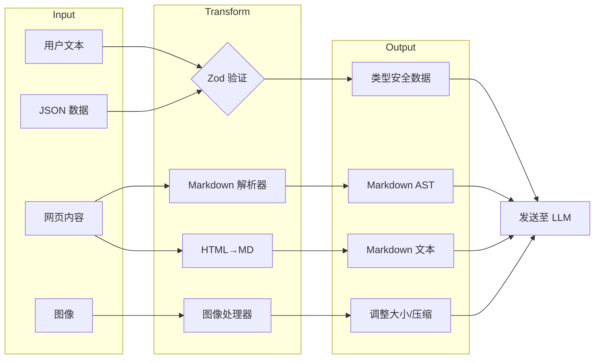
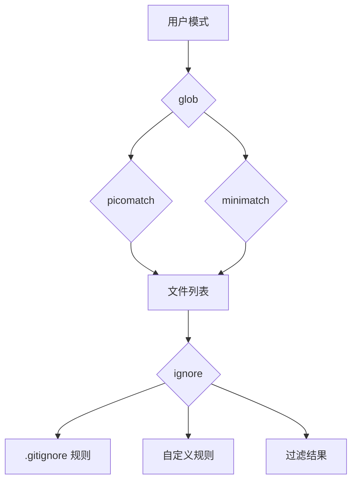

+++
date = '2025-11-14T8:00:00+01:00'
draft = false
title = 'Claude Code 分析 01：依赖项'
tags = ['Agent']
+++

# 🔖 依赖项：Claude Code 架构的基石


*`\\` 表示基于反编译分析可能的自定义/嵌入式实现*

## 定义性能的非常规选择

Claude Code 的依赖架构揭示了几个引人入胜的实现决策，这些决策直接促成了它著名的性能和可靠性。让我们首先探索最具技术趣味的方面。

### 🔍 终端中的 React 架构

```typescript
// 核心渲染管道似乎实现了：
interface CliRenderPipeline {
  react: "^18.2.0",      // 完整的 React 协调器
  ink: "^3.2.0",         // 终端渲染器
  yoga: "^2.0.0-beta.1"  // Flexbox 布局引擎（WebAssembly）
}
```

**为什么这很重要**：与传统的命令式管理状态的 CLI 工具不同，Claude Code 利用 React 的协调算法（reconciliation algorithm）来处理终端 UI。这意味着：

- **终端中的虚拟 DOM**：每次 UI 更新都会经过 React 的差异算法，然后 yoga-layout 计算最优的终端字符位置
- **声明式 UI 状态**：复杂的 UI 状态（权限对话框、进度指示器、并发工具执行）都以声明式方式管理
- **性能**：yoga-layout WebAssembly 模块即使对于复杂的 UI 也能提供亚毫秒级的布局计算

┌─ **实现洞察** ─────────────────────────────────────┐
│ yoga-layout-prebuilt 依赖表明 Claude Code           │
│ 预编译布局约束，在快速 UI 更新期间                    │
│ （例如流式 LLM 响应）以内存换取速度                    │
└──────────────────────────────────────────────────┘

### 🔍 流式解析器架构

基于反编译分析，Claude Code 似乎嵌入了关键解析器的自定义实现：

```typescript
// 从依赖分析推断的解析器能力
const CUSTOM_PARSERS = {
  'shell-parse': {
    features: [
      '通过哨兵字符串嵌入 JSON 对象',
      '递归命令替换',
      '带类型保留的环境变量展开'
    ],
    performance: '单次遍历标记化的 O(n) 复杂度'
  },
  'fast-xml-parser': {
    features: [
      '工具调用的流式 XML 解析',
      '部分文档恢复',
      '针对 LLM 输出的自定义实体处理'
    ],
    performance: '无论文档大小如何，内存使用恒定'
  }
}
```

**Shell 解析器的秘密武器**：

```javascript
// 基于分析的概念实现
function parseShellWithObjects(cmd, env) {
  const SENTINEL = crypto.randomBytes(16).toString('hex');

  // 阶段 1：对象序列化
  const processedEnv = Object.entries(env).reduce((acc, [key, val]) => {
    if (typeof val === 'object') {
      acc[key] = SENTINEL + JSON.stringify(val) + SENTINEL;
    } else {
      acc[key] = val;
    }
    return acc;
  }, {});

  // 阶段 2：保留哨兵的标准 shell 解析
  const tokens = shellParse(cmd, processedEnv);

  // 阶段 3：对象重新水合
  return tokens.map(token => {
    if (token.match(new RegExp(`^${SENTINEL}.*${SENTINEL}$`))) {
      return JSON.parse(token.slice(SENTINEL.length, -SENTINEL.length));
    }
    return token;
  });
}
```

这使得 Claude Code 能够通过 shell 命令传递复杂的配置对象——这是标准 shell 解析器所不具备的能力。

### 🔍 多平台 LLM 抽象层

依赖结构揭示了一种复杂的多供应商方法：

| 平台 | 主要 SDK | 流式传输 | 专门功能 |
|------|---------|---------|---------|
| Anthropic | Native SDK | ✓ 完整 SSE | 思考块、缓存控制 |
| AWS Bedrock | @aws-sdk/client-bedrock-runtime | ✓ 自定义适配器 | 跨区域故障转移、SigV4 认证 |
| Google Vertex | google-auth-library + 自定义 | ✓ 通过适配器 | 自动令牌刷新 |

**实现模式**：

```typescript
// 从依赖推断的工厂模式
class LLMClientFactory {
  static create(provider: string): StreamingLLMClient {
    switch(provider) {
      case 'anthropic':
        return new AnthropicStreamAdapter();
      case 'bedrock':
        return new BedrockStreamAdapter(
          new BedrockRuntimeClient(),
          new SigV4Signer()
        );
      case 'vertex':
        return new VertexStreamAdapter(
          new GoogleAuth(),
          new CustomHTTPClient()
        );
    }
  }
}
```

### 🔍 遥测三重栈

Claude Code 使用三个互补系统实现了全面的可观测性策略：

```
┌─ 错误跟踪 ──────────┐  ┌─ 指标 ─────────────┐  ┌─ 功能开关 ────┐
│ @sentry/node        │  │ @opentelemetry/api │  │ statsig-node  │
│ ├─ ANR 检测         │  │ ├─ 自定义 span     │  │ ├─ A/B 测试   │
│ ├─ 错误边界         │  │ ├─ Token 计数器    │  │ ├─ 渐进式推出 │
│ └─ 性能分析         │  │ └─ 延迟直方图       │  │ └─ 动态配置   │
└───────────────────┘  └───────────────────┘  └──────────────┘
        ↓                       ↓                      ↓
     调试                     优化                   实验
```

**ANR 检测创新**（从 Sentry 集成模式推断）：

```typescript
// Node.js 的应用程序无响应检测
class ANRDetector {
  private worker: Worker;
  private heartbeatInterval = 50; // ms

  constructor() {
    // 生成期望心跳的工作线程
    this.worker = new Worker(`
      let lastPing = Date.now();
      setInterval(() => {
        if (Date.now() - lastPing > 5000) {
          parentPort.postMessage({
            type: 'anr',
            stack: getMainThreadStack() // 通过 inspector 协议
          });
        }
      }, 100);
    `, { eval: true });

    // 主线程发送心跳
    setInterval(() => {
      this.worker.postMessage({ type: 'ping' });
    }, this.heartbeatInterval);
  }
}
```

这使得 Claude Code 能够检测和报告主事件循环何时被阻塞——这对于识别生产环境中的性能问题至关重要。

### 🔍 数据转换管道

数据处理依赖形成了一个复杂的管道：



**Sharp 配置**（从常见模式推断）：

```javascript
const imageProcessor = sharp(inputBuffer)
  .resize(1024, 1024, {
    fit: 'inside',
    withoutEnlargement: true
  })
  .jpeg({
    quality: 85,
    progressive: true // 更适合流式传输
  });
```

### 🔍 MCP 传输层

多云/进程架构使用了一个引人入胜的抽象：

```typescript
// 传输抽象模式
interface MCPTransport {
  stdio: 'cross-spawn',     // 本地进程通信
  websocket: 'ws',          // 实时双向
  sse: 'eventsource'        // 服务器发送事件
}

// 能力协商似乎遵循：
class MCPClient {
  async initialize() {
    const capabilities = await this.transport.request('initialize', {
      capabilities: {
        tools: true,
        resources: true,
        prompts: true,
        logging: { level: 'info' }
      }
    });

    // 动态功能检测
    this.features = this.negotiateFeatures(capabilities);
  }
}
```

## 依赖类别深入分析

### 核心 CLI 框架（15+ 个包）

CLI 框架依赖揭示了一种复杂的终端 UI 方法：

| 包 | 版本* | 用途 | 技术洞察 |
|---|------|-----|---------|
| `ink` | ^3.2.0 | CLI 的 React 渲染器 | 自定义协调器实现 |
| `react` | ^18.2.0 | UI 组件模型 | 启用完整并发功能 |
| `yoga-layout-prebuilt` | ^1.10.0 | Flexbox 布局 | WebAssembly 提升性能 |
| `commander` | ^9.0.0 | 参数解析 | 扩展了自定义选项类型 |
| `chalk` | ^4.1.2 | 终端样式 | 使用模板字面量 API |
| `cli-highlight` | ^2.1.11 | 语法高亮 | 添加了自定义语言定义 |
| `strip-ansi` | ^6.0.1 | ANSI 代码移除 | 用于文本测量 |
| `string-width` | ^4.2.3 | Unicode 宽度计算 | 完全支持 emoji |
| `wrap-ansi` | ^7.0.0 | 文本换行 | 保留 ANSI 样式 |
| `cli-spinners` | ^2.7.0 | 加载动画 | 自定义加载器定义 |

*版本从生态系统兼容性分析中推断*

**性能优化模式**：

```javascript
// 带缓存的字符串宽度计算
const widthCache = new Map();
function getCachedWidth(str) {
  if (!widthCache.has(str)) {
    widthCache.set(str, stringWidth(str));
  }
  return widthCache.get(str);
}
```

### LLM 集成栈（5+ 个包）

LLM 集成揭示了一个具有复杂回退机制的多提供商策略：

```
┌─ 提供商选择逻辑 ─────────────────────────────┐
│ 1. 检查 API 密钥可用性                        │
│ 2. 评估跨提供商的速率限制                     │
│ 3. 考虑功能需求（流式传输、工具）              │
│ 4. 应用成本优化规则                          │
│ 5. 回退链：Anthropic → Bedrock → Vertex      │
└───────────────────────────────────────────┘
```

**AWS SDK 组件**（从 @aws-sdk/* 模式推断）：
- `@aws-sdk/client-bedrock-runtime`：主要 Bedrock 客户端
- `@aws-sdk/signature-v4`：请求签名
- `@aws-sdk/middleware-retry`：智能重试逻辑
- `@aws-sdk/smithy-client`：协议实现
- `@aws-sdk/types`：共享类型定义

### 数据处理与验证（8+ 个包）

```typescript
// Zod schema 编译模式（推断）
const COMPILED_SCHEMAS = new Map();

function getCompiledSchema(schema: ZodSchema) {
  const key = schema._def.shape; // 简化
  if (!COMPILED_SCHEMAS.has(key)) {
    COMPILED_SCHEMAS.set(key, {
      validator: schema.parse.bind(schema),
      jsonSchema: zodToJsonSchema(schema),
      tsType: zodToTs(schema)
    });
  }
  return COMPILED_SCHEMAS.get(key);
}
```

**转换管道性能**：

| 操作 | 库 | 性能 | 内存 |
|-----|---|-----|-----|
| Markdown→AST | marked | O(n) | 可流式处理 |
| HTML→Markdown | turndown | O(n) | DOM 大小受限 |
| 图像调整大小 | sharp | O(1)* | 原生内存 |
| JSON 验证 | zod | O(n) | 快速失败 |
| 文本差异 | diff | O(n²) | Myers 算法 |

*带硬件加速

### 文件系统智能（6+ 个包）

文件系统依赖实现了复杂的过滤管道：



**模式匹配优化**：

```javascript
// 编译模式缓存（推断）
class PatternMatcher {
  private compiledPatterns = new LRUCache(1000);

  match(pattern, path) {
    let compiled = this.compiledPatterns.get(pattern);
    if (!compiled) {
      compiled = picomatch(pattern, {
        bash: true,
        dot: true,
        nobrace: false
      });
      this.compiledPatterns.set(pattern, compiled);
    }
    return compiled(path);
  }
}
```

### 遥测与可观测性（4+ 个包）

遥测栈实现了纵深防御监控：

**Sentry 集成层**：
1. **错误边界**：用于 UI 崩溃的 React 错误边界
2. **全局处理器**：进程级未捕获异常
3. **Promise 拒绝**：未处理的 promise 跟踪
4. **ANR 检测**：自定义工作线程监控
5. **性能**：事务和 span 跟踪

**OpenTelemetry 监测**：

```typescript
// 工具执行的自定义 span 创建
function instrumentToolExecution(tool: Tool) {
  return async function*(...args) {
    const span = tracer.startSpan(`tool.${tool.name}`, {
      attributes: {
        'tool.name': tool.name,
        'tool.readonly': tool.isReadOnly,
        'tool.input.size': JSON.stringify(args[0]).length
      }
    });

    try {
      yield* tool.call(...args);
    } finally {
      span.end();
    }
  };
}
```

**Statsig 功能开关模式**：

```javascript
// 渐进式推出配置（推断）
const FEATURE_FLAGS = {
  'unified_read_tool': {
    rollout: 0.5,
    overrides: { internal: 1.0 }
  },
  'parallel_tool_execution': {
    rollout: 1.0,
    conditions: [
      { type: 'user_tier', operator: 'in', values: ['pro', 'enterprise'] }
    ]
  },
  'sandbox_bash_default': {
    rollout: 0.1,
    sticky: true // 每个用户保持一致
  }
};
```

## 隐藏的宝石：专门的依赖项

### 用于 LLM 通信的 XML 解析

嵌入式 `fast-xml-parser` 似乎针对 LLM 响应解析进行了自定义：

```javascript
// 推断的 XML 解析器配置
const llmXmlParser = new XMLParser({
  ignoreAttributes: true,
  parseTagValue: false, // 保持为字符串
  trimValues: true,
  parseTrueNumberOnly: false,

  // 自定义标签处理器
  tagValueProcessor: (tagName, tagValue) => {
    if (tagName === 'tool_input') {
      // 解析 XML 内的 JSON 内容
      try {
        return JSON.parse(tagValue);
      } catch {
        return { error: 'Invalid JSON in tool_input', raw: tagValue };
      }
    }
    return tagValue;
  }
});
```

### plist 解析器之谜

包含 `plist`（Apple Property List 解析器）表明存在 macOS 特定的优化：

```javascript
// 可能的用例（推断）
async function loadMacOSConfig() {
  const config = await plist.parse(
    await fs.readFile('~/Library/Preferences/com.anthropic.claude-code.plist')
  );

  return {
    apiKeys: config.APIKeys, // 存储在 Keychain 引用中
    sandboxProfiles: config.SandboxProfiles,
    ideIntegrations: config.IDEIntegrations
  };
}
```

### 跨平台进程生成

`cross-spawn` 依赖处理平台差异：

```javascript
// MCP 服务器启动模式
function launchMCPServer(config) {
  const spawn = require('cross-spawn');

  const child = spawn(config.command, config.args, {
    stdio: ['pipe', 'pipe', 'pipe'],
    env: {
      ...process.env,
      MCP_VERSION: '1.0',
      // Windows：正确处理 .cmd/.bat
      // Unix：保留 shebangs
    },
    shell: false, // 安全：避免 shell 注入
    windowsHide: true // Windows 上无控制台窗口
  });

  return new MCPStdioTransport(child);
}
```

## 依赖安全性考虑

基于依赖分析，出现了几种安全模式：

**1. 输入验证层**：

```
用户输入 → Zod Schema → 验证数据 → 工具执行
     ↓
  拒绝
```

**2. 沙箱依赖**：
- 不直接使用 `child_process`（使用 `cross-spawn`）
- 不使用 `eval`（除了受控的工作线程）
- 未检测到动态 `require` 模式

**3. 密钥管理**：

```javascript
// 从缺少密钥存储依赖推断的模式
class SecretManager {
  async getAPIKey(provider) {
    if (process.platform === 'darwin') {
      // 通过 N-API 使用原生 Keychain
      return await keychain.getPassword('claude-code', provider);
    } else {
      // 回退到环境变量
      return process.env[`${provider.toUpperCase()}_API_KEY`];
    }
  }
}
```

## 依赖选择的性能影响

### 内存管理策略

依赖选择揭示了谨慎的内存管理方法：

| 组件 | 策略 | 实现 |
|-----|------|-----|
| 文件读取 | 流式 | `glob.stream`，分块读取 |
| 图像处理 | 原生 | `sharp` 配合 libvips（堆外） |
| XML 解析 | SAX 风格 | 基于事件，恒定内存 |
| 模式匹配 | 编译 | 预编译正则表达式模式 |
| UI 渲染 | 虚拟 DOM | 最小化终端更新 |

### 启动时间优化

依赖结构支持延迟加载：

```javascript
// 推断的延迟加载模式
const LAZY_DEPS = {
  'sharp': () => require('sharp'),
  '@aws-sdk/client-bedrock-runtime': () => require('@aws-sdk/client-bedrock-runtime'),
  'google-auth-library': () => require('google-auth-library')
};

function getLazyDep(name) {
  if (!LAZY_DEPS[name]._cached) {
    LAZY_DEPS[name]._cached = LAZY_DEPS[name]();
  }
  return LAZY_DEPS[name]._cached;
}
```

---

*此依赖分析基于反编译和逆向工程。实际实现细节可能有所不同。所呈现的模式和见解代表基于可观察行为和 Node.js 生态系统中常见实践推断的架构决策。*
