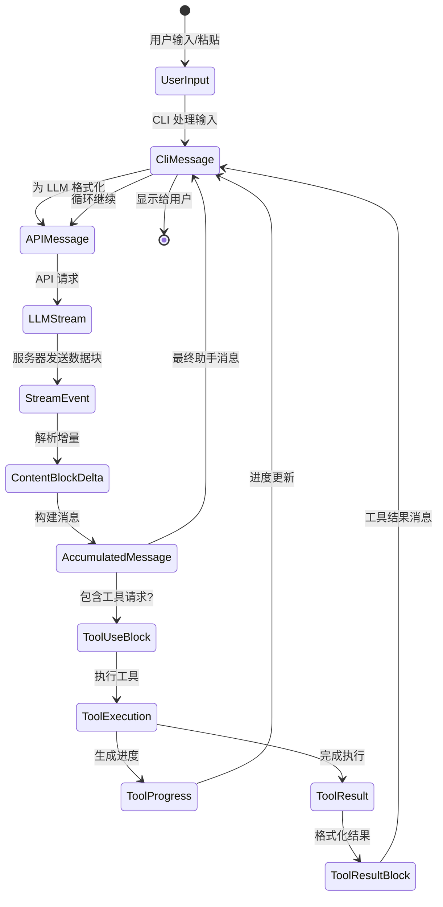
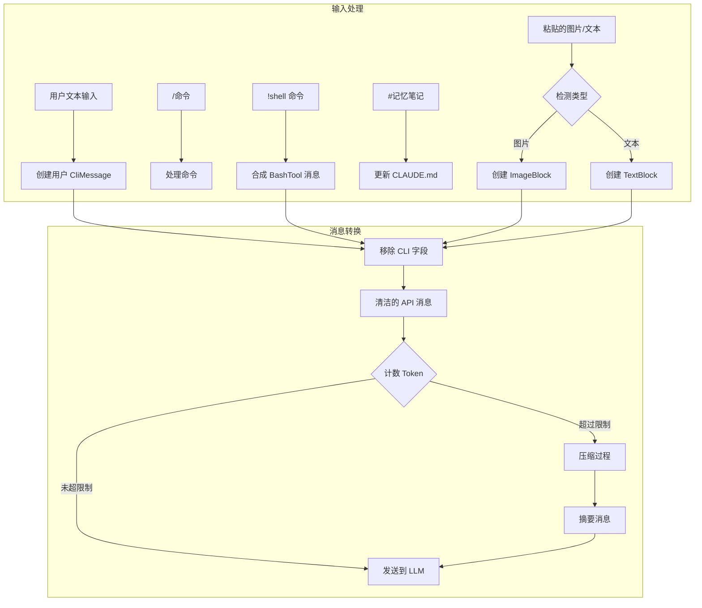
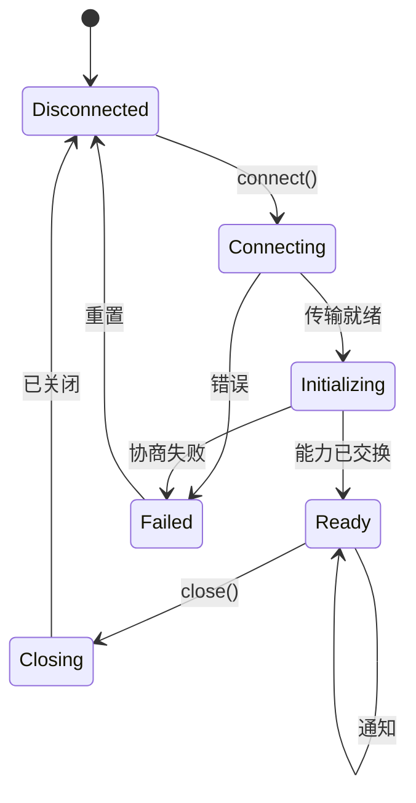

+++
date = '2025-11-14T10:00:00+01:00'
draft = false
title = 'Claude Code 分析 02：数据结构'
tags = ['Agent']
+++

# 📊 数据结构与信息架构



## 流式状态机: 消息如何转换

Claude Code 数据架构最令人着迷的方面是它如何在保持流式性能的同时,管理数据在多个表示形式之间的转换。让我们从核心创新开始:

```typescript
// 双重表示消息系统 (从分析中推断)
interface MessageTransformPipeline {
  // 阶段 1: CLI 内部表示
  cliMessage: {
    type: "user" | "assistant" | "attachment" | "progress"
    uuid: string  // CLI 特定的跟踪
    timestamp: string
    message?: APICompatibleMessage  // 仅用于 user/assistant
    attachment?: AttachmentContent   // 仅用于 attachment
    progress?: ProgressUpdate        // 仅用于 progress
  }

  // 阶段 2: API 线上格式
  apiMessage: {
    role: "user" | "assistant"
    content: string | ContentBlock[]
    // 没有 CLI 特定字段
  }

  // 阶段 3: 流式累加器
  streamAccumulator: {
    partial: Partial<APIMessage>
    deltas: ContentBlockDelta[]
    buffers: Map<string, string>  // tool_use_id → 累积的 JSON
  }
}
```

**为什么这很重要**: 这种三阶段表示允许 Claude Code 在处理复杂流式协议的同时保持 UI 响应性。CLI 可以使用 `CliMessage` 元数据更新进度指示器,而实际的 LLM 通信使用简洁的 `APIMessage` 格式。

## ContentBlock: 多态构建块

基于反编译分析,Claude Code 为内容实现了一个复杂的类型系统:

```typescript
// ContentBlock 可辨识联合类型 (重构)
type ContentBlock =
  | TextBlock
  | ImageBlock
  | ToolUseBlock
  | ToolResultBlock
  | ThinkingBlock
  | DocumentBlock      // 平台特定
  | VideoBlock         // 平台特定
  | GuardContentBlock  // 平台特定
  | ReasoningBlock     // 平台特定
  | CachePointBlock    // 平台特定

// 基于推断使用的性能注解
interface ContentBlockMetrics {
  TextBlock: {
    memorySize: "O(text.length)",
    parseTime: "O(1)",
    serializeTime: "O(n)",
    streamable: true
  },
  ImageBlock: {
    memorySize: "O(1) + external",  // 引用到 base64/S3
    parseTime: "O(1)",
    serializeTime: "O(size)" | "O(1) for S3",
    streamable: false
  },
  ToolUseBlock: {
    memorySize: "O(JSON.stringify(input).length)",
    parseTime: "O(n) for JSON parse",
    serializeTime: "O(n)",
    streamable: true  // JSON 可以流式传输
  }
}
```

### 流式 JSON 挑战

Claude Code 最巧妙的创新之一是处理工具输入的流式 JSON:

```typescript
// 推断的流式 JSON 解析器实现
class StreamingToolInputParser {
  private buffer: string = '';
  private depth: number = 0;
  private inString: boolean = false;
  private escape: boolean = false;

  addChunk(chunk: string): ParseResult {
    this.buffer += chunk;

    // 跟踪 JSON 结构深度
    for (const char of chunk) {
      if (!this.inString) {
        if (char === '{' || char === '[') this.depth++;
        else if (char === '}' || char === ']') this.depth--;
      }

      // 跟踪字符串边界
      if (char === '"' && !this.escape) {
        this.inString = !this.inString;
      }
      this.escape = (char === '\\' && !this.escape);
    }

    // 在深度为 0 时尝试解析
    if (this.depth === 0 && this.buffer.length > 0) {
      try {
        return { complete: true, value: JSON.parse(this.buffer) };
      } catch (e) {
        // 尝试自动关闭未闭合的字符串
        if (this.inString) {
          try {
            return {
              complete: true,
              value: JSON.parse(this.buffer + '"'),
              repaired: true
            };
          } catch {}
        }
        return { complete: false, error: e };
      }
    }

    return { complete: false };
  }
}
```

这个解析器可以处理来自 LLM 的增量 JSON 块,一旦结构看起来完整就尝试解析。

## 消息生命周期: 从用户输入到 LLM 再返回



### CliMessage 结构: 不止表面所见

`CliMessage` 类型充当应用程序的中枢神经系统:

```typescript
interface CliMessage {
  type: "user" | "assistant" | "attachment" | "progress"
  uuid: string
  timestamp: string

  // 仅用于 user/assistant 消息
  message?: {
    role: "user" | "assistant"
    id?: string                    // LLM 提供的 ID
    model?: string                 // 哪个模型响应
    stop_reason?: StopReason       // 为什么停止生成
    stop_sequence?: string         // 命中的特定停止序列
    usage?: TokenUsage             // 详细的 token 计数
    content: string | ContentBlock[]
  }

  // CLI 特定的元数据
  costUSD?: number               // 计算的成本
  durationMs?: number            // API 调用持续时间
  requestId?: string             // 用于调试
  isApiErrorMessage?: boolean    // 错误显示标志
  isMeta?: boolean              // 系统生成的消息

  // 类型特定字段
  attachment?: AttachmentContent
  progress?: {
    toolUseID: string
    parentToolUseID?: string   // 用于 AgentTool 子工具
    data: any                  // 工具特定的进度
  }
}

// 性能特性
interface CliMessagePerformance {
  creation: "O(1)",
  serialization: "O(content size)",
  memoryRetention: "大内容使用弱引用",
  garbageCollection: "从历史数组中移除时符合回收条件"
}
```

### 变异点和状态转换

Claude Code 仔细控制数据结构可以被修改的位置:

```typescript
// 推断的变异控制模式
class MessageMutationControl {
  // 变异点 1: 流式累积
  static accumulateStreamDelta(
    message: Partial<CliMessage>,
    delta: ContentBlockDelta
  ): void {
    if (delta.type === 'text_delta') {
      const lastBlock = message.content[message.content.length - 1];
      if (lastBlock.type === 'text') {
        lastBlock.text += delta.text;  // 变异
      }
    }
  }

  // 变异点 2: 工具结果注入
  static injectToolResult(
    history: CliMessage[],
    toolResult: ToolResultBlock
  ): void {
    const newMessage: CliMessage = {
      type: 'user',
      isMeta: true,  // 系统生成
      message: {
        role: 'user',
        content: [toolResult]
      },
      // ... 其他字段
    };
    history.push(newMessage);  // 变异
  }

  // 变异点 3: 成本计算
  static updateCostMetadata(
    message: CliMessage,
    usage: TokenUsage
  ): void {
    message.costUSD = calculateCost(usage, message.model);  // 变异
    message.durationMs = Date.now() - parseISO(message.timestamp);  // 变异
  }
}
```

## 系统提示: 动态上下文组装

可能最复杂的数据结构是动态组装的系统提示:

```typescript
// 系统提示组装流水线 (重构)
interface SystemPromptPipeline {
  sources: {
    baseInstructions: string        // 静态基础
    claudeMdContent: ClaudeMdLayer[] // 分层的
    gitContext: GitContextData       // 实时
    directoryStructure: TreeData     // 缓存/新鲜
    toolDefinitions: ToolSpec[]      // 可用工具
    modelAdaptations: ModelSpecificPrompt // 每个模型
  }

  assembly: {
    order: ['base', 'model', 'claude.md', 'git', 'files', 'tools'],
    separators: Map<string, string>,  // 部分分隔符
    sizeLimit: number,                // Token 预算
    prioritization: 'recency' | 'relevance'
  }
}

// GitContext 结构揭示了实时感知
interface GitContextData {
  currentBranch: string
  status: {
    modified: string[]
    untracked: string[]
    staged: string[]
  }
  recentCommits: Array<{
    hash: string
    message: string
    author: string
    timestamp: string
  }>
  uncommittedDiff?: string  // 昂贵,有条件
}
```

### 内存布局: CLAUDE.md 分层加载

```plain text
项目根目录
├── .claude/
│   ├── CLAUDE.md (本地 - 最高优先级)
│   └── settings.json
├── ~/
│   └── .claude/
│       └── CLAUDE.md (用户 - 第二优先级)
├── <project-root>/
│   └── .claude/
│       └── CLAUDE.md (项目 - 第三优先级)
└── /etc/claude-code/
    └── CLAUDE.md (托管 - 最低优先级)
```

加载机制实现了高效的合并策略:

```typescript
// 推断的 CLAUDE.md 加载算法
class ClaudeMdLoader {
  private cache = new Map<string, {content: string, mtime: number}>();

  async loadMerged(): Promise<string> {
    const layers = [
      '/etc/claude-code/CLAUDE.md',      // 托管
      '~/.claude/CLAUDE.md',              // 用户
      '<project>/.claude/CLAUDE.md',      // 项目
      '.claude/CLAUDE.md'                 // 本地
    ];

    const contents = await Promise.all(
      layers.map(path => this.loadWithCache(path))
    );

    // 使用覆盖语义合并
    return this.mergeWithOverrides(contents);
  }

  private mergeWithOverrides(contents: string[]): string {
    // 后面的层覆盖前面的层
    // @override 指令用于显式覆盖
    // @append 指令用于添加
    // 默认: 用分隔符连接
  }
}
```

## 工具相关的数据结构

### ToolDefinition: 完整的工具接口

```typescript
interface ToolDefinition {
  // 标识
  name: string
  description: string
  prompt?: string  // 额外的 LLM 指令

  // 模式 (双重表示)
  inputSchema: ZodSchema          // 运行时验证
  inputJSONSchema?: JSONSchema    // LLM 通信

  // 执行
  call: AsyncGenerator<ToolProgress | ToolResult, void, void>

  // 权限
  checkPermissions?: (
    input: any,
    context: ToolUseContext,
    permContext: ToolPermissionContext
  ) => Promise<PermissionDecision>

  // 输出格式化
  mapToolResultToToolResultBlockParam: (
    result: any,
    toolUseId: string
  ) => ContentBlock | ContentBlock[]

  // 元数据
  isReadOnly: boolean
  isMcp?: boolean
  isEnabled?: (config: any) => boolean
  getPath?: (input: any) => string | undefined

  // UI
  renderToolUseMessage?: (input: any) => ReactElement
}

// 工具定义的内存特性
interface ToolDefinitionMemory {
  staticSize: "每个工具约 2KB",
  zodSchema: "延迟编译,已缓存",
  jsonSchema: "生成一次,记忆化",
  closures: "保留上下文引用"
}
```

### 执行上下文: 工具需要的一切

```typescript
interface ToolUseContext {
  // 取消
  abortController: AbortController

  // 文件状态跟踪
  readFileState: Map<string, {
    content: string
    timestamp: number  // mtime
  }>

  // 权限解析
  getToolPermissionContext: () => ToolPermissionContext

  // 选项包
  options: {
    tools: ToolDefinition[]
    mainLoopModel: string
    debug?: boolean
    verbose?: boolean
    isNonInteractiveSession?: boolean
    maxThinkingTokens?: number
  }

  // MCP 连接
  mcpClients?: McpClient[]
}

// 权限上下文揭示了复杂的安全模型
interface ToolPermissionContext {
  mode: "default" | "acceptEdits" | "bypassPermissions"

  additionalWorkingDirectories: Set<string>

  // 分层规则系统
  alwaysAllowRules: Record<PermissionRuleScope, string[]>
  alwaysDenyRules: Record<PermissionRuleScope, string[]>
}

type PermissionRuleScope =
  | "cliArg"         // 最高优先级
  | "localSettings"
  | "projectSettings"
  | "policySettings"
  | "userSettings"   // 最低优先级
```

## MCP 协议结构

多云/进程协议揭示了复杂的 RPC 系统:

```typescript
// JSON-RPC 2.0 及其扩展
interface McpMessage {
  jsonrpc: "2.0"
  id?: string | number  // 通知可选
}

interface McpRequest extends McpMessage {
  method: string
  params?: unknown
}

interface McpResponse extends McpMessage {
  id: string | number  // 响应必需
  result?: unknown
  error?: {
    code: number
    message: string
    data?: unknown
  }
}

// 能力协商结构
interface McpCapabilities {
  experimental?: Record<string, any>

  // 功能标志
  roots?: boolean      // 工作区根目录
  sampling?: boolean   // LLM 采样委托
  prompts?: boolean    // 动态提示
  resources?: boolean  // 资源服务
  tools?: boolean      // 工具暴露
  logging?: boolean    // 日志转发
}

// MCP 服务器发送的工具规范
interface McpToolSpec {
  name: string
  description?: string
  inputSchema: JSONSchema  // 始终是 JSON Schema

  // MCP 特定元数据
  isReadOnly?: boolean
  requiresConfirmation?: boolean
  timeout?: number
  maxRetries?: number
}
```

### MCP 状态机



## 会话状态: 全局内存

```typescript
interface SessionState {
  // 标识
  sessionId: string  // UUID v4
  originalCwd: string
  cwd: string  // 可以通过 bash cd 改变

  // 成本跟踪 (可变累加器)
  totalCostUSD: number
  totalAPIDuration: number
  modelTokens: Record<string, {
    inputTokens: number
    outputTokens: number
    cacheReadInputTokens: number
    cacheCreationInputTokens: number
  }>

  // 模型选择
  mainLoopModelOverride?: string
  initialMainLoopModel?: string

  // 活动指标
  sessionCounter: number
  locCounter: number      // 代码行数
  prCounter: number       // Pull requests
  commitCounter: number   // Git commits

  // 状态标志
  lastInteractionTime: number
  hasUnknownModelCost: boolean
  maxRateLimitFallbackActive: boolean

  // 可用模型
  modelStrings: string[]
}

// 会话状态访问模式 (推断)
class SessionManager {
  private static state: SessionState;  // 单例

  static update<K extends keyof SessionState>(
    key: K,
    value: SessionState[K]
  ): void {
    this.state[key] = value;
    this.persistToDisk();  // 异步,非阻塞
  }

  static increment(metric: keyof SessionState): void {
    if (typeof this.state[metric] === 'number') {
      this.state[metric]++;
    }
  }
}
```

## 双向流式实现

平台级流式揭示了复杂的协议:

```typescript
// 双向流式有效载荷结构
interface BidirectionalStreamingProtocol {
  // 客户端 → 服务器
  clientPayload: {
    bytes: string  // Base64 编码
    encoding: 'base64'

    // 解码的内容类型
    contentTypes:
      | ContinuedUserInput
      | ToolResultBlock
      | ConversationTurnInput
  }

  // 服务器 → 客户端
  serverPayload: {
    bytes: string  // Base64 编码
    encoding: 'base64'

    // 解码的事件类型
    eventTypes:
      | ContentBlockDeltaEvent
      | ToolUseRequestEvent
      | ErrorEvent
      | MetadataEvent
  }
}

// 双向流的流式状态机
class BidirectionalStreamManager {
  private encoder = new TextEncoder();
  private decoder = new TextDecoder();
  private buffer = new Uint8Array(65536);  // 64KB 缓冲区

  async *processStream(stream: ReadableStream) {
    const reader = stream.getReader();
    let partial = '';

    while (true) {
      const { done, value } = await reader.read();
      if (done) break;

      // 解码并按换行符分割 (SSE 格式)
      partial += this.decoder.decode(value, { stream: true });
      const lines = partial.split('\n');
      partial = lines.pop() || '';

      for (const line of lines) {
        if (line.startsWith('data: ')) {
          const payload = JSON.parse(line.slice(6));
          yield this.decodePayload(payload);
        }
      }
    }
  }

  private decodePayload(payload: any) {
    const bytes = Buffer.from(payload.bytes, 'base64');
    // 根据协议缓冲区或 JSON 进一步解码
    return JSON.parse(bytes.toString());
  }
}
```

## 数据结构中的性能优化

### 1. **常见值的字符串驻留**

```typescript
// 推断的字符串驻留模式
class StringIntern {
  private static pool = new Map<string, string>();

  static intern(str: string): string {
    if (!this.pool.has(str)) {
      this.pool.set(str, str);
    }
    return this.pool.get(str)!;
  }
}

// 在消息处理中的使用
message.type = StringIntern.intern(rawType);  // 'user', 'assistant' 等
message.stop_reason = StringIntern.intern(reason);  // 'end_turn', 'tool_use' 等
```

### 2. **延迟内容块解析**

```typescript
// 内容块可能使用延迟解析以提高性能
class LazyContentBlock {
  private _raw: string;
  private _parsed?: any;

  constructor(raw: string) {
    this._raw = raw;
  }

  get content() {
    if (!this._parsed) {
      this._parsed = this.parse(this._raw);
    }
    return this._parsed;
  }

  private parse(raw: string): any {
    // 仅在访问时进行昂贵的解析
    return JSON.parse(raw);
  }
}
```

### 3. **ReadFileState 弱引用**

```typescript
// 具有自动内存管理的文件缓存
class ReadFileState {
  private cache = new Map<string, WeakRef<FileContent>>();
  private registry = new FinalizationRegistry((path: string) => {
    this.cache.delete(path);
  });

  set(path: string, content: FileContent) {
    const ref = new WeakRef(content);
    this.cache.set(path, ref);
    this.registry.register(content, path);
  }

  get(path: string): FileContent | undefined {
    const ref = this.cache.get(path);
    if (ref) {
      const content = ref.deref();
      if (!content) {
        this.cache.delete(path);
      }
      return content;
    }
  }
}
```
