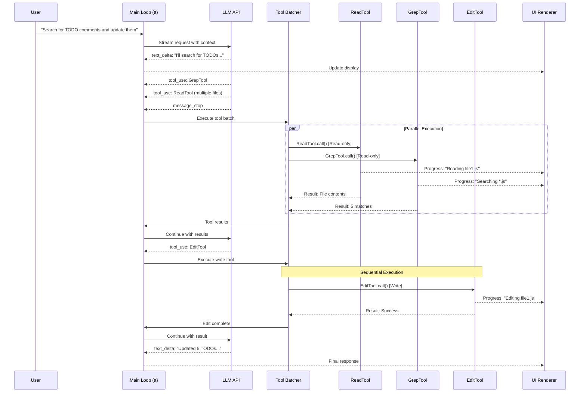
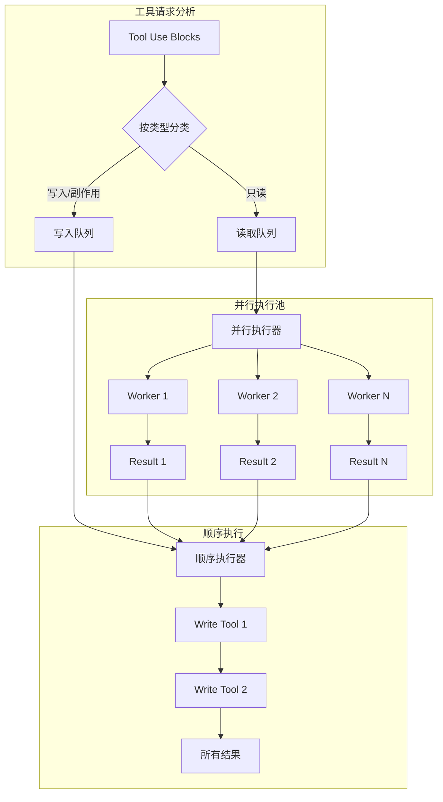
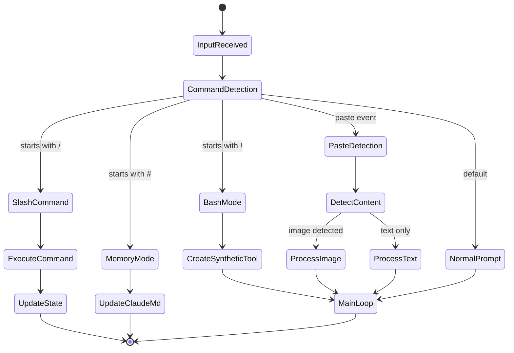
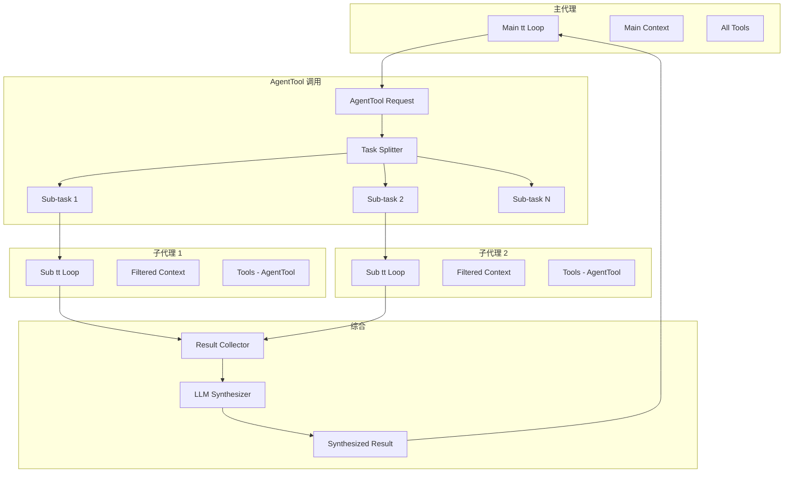

+++
date = '2025-11-14T11:00:00+01:00'
draft = false
title = 'Claude Code 分析 03：控制流'
tags = ['Agent']
+++

# 🔄 控制流与编排引擎



## 主对话循环：一个流式状态机

Claude Code 的核心是 `tt` 异步生成器函数——一个编排整个对话流程的复杂状态机。让我们来看看它的实际结构：

```typescript
// 重构的主循环签名，带有时间注解
async function* tt(
  currentMessages: CliMessage[],         // 完整历史 - 内存: O(conversation_length)
  baseSystemPromptString: string,        // 静态提示词 - ~2KB
  currentGitContext: GitContext,         // Git 状态 - 通常 ~1-5KB
  currentClaudeMdContents: ClaudeMdContent[], // 项目上下文 - ~5-50KB
  permissionGranterFn: PermissionGranter, // 权限回调
  toolUseContext: ToolUseContext,         // 共享上下文 - ~10KB
  activeStreamingToolUse?: ToolUseBlock,  // 恢复状态
  loopState: {
    turnId: string,        // 本轮的 UUID
    turnCounter: number,   // 递归深度
    compacted?: boolean,   // 历史是否被压缩
    isResuming?: boolean   // 是否从保存中恢复
  }
): AsyncGenerator<CliMessage, void, void> {
  // ┌─ 阶段 1: 上下文准备 [~50-200ms]
  // ├─ 阶段 2: 自动压缩检查 [触发时 ~0-3000ms]
  // ├─ 阶段 3: 系统提示词组装 [~10-50ms]
  // ├─ 阶段 4: LLM 流处理 [~2000-10000ms]
  // ├─ 阶段 5: 工具执行 [每个工具 ~100-30000ms]
  // └─ 阶段 6: 递归或完成 [~0ms]
}
```

### 阶段 1：上下文窗口管理

控制流中的第一个关键决策是判断对话是否需要压缩：

```typescript
// 自动压缩逻辑（推断实现）
class ContextCompactionController {
  private static readonly COMPACTION_THRESHOLDS = {
    tokenCount: 100_000,      // 激进的 token 限制
    messageCount: 200,        // 消息数量备选
    costThreshold: 5.00       // 基于成本的触发器
  };

  static async shouldCompact(
    messages: CliMessage[],
    model: string
  ): Promise<boolean> {
    // 快速路径：首先检查消息数量
    if (messages.length < 50) return false;

    // 昂贵路径：计算 token
    const tokenCount = await this.estimateTokens(messages, model);

    return tokenCount > this.COMPACTION_THRESHOLDS.tokenCount ||
           messages.length > this.COMPACTION_THRESHOLDS.messageCount;
  }

  static async compact(
    messages: CliMessage[],
    context: ToolUseContext
  ): Promise<CompactionResult> {
    // 阶段 1：识别需要保留的消息
    const preserve = this.identifyPreservedMessages(messages);

    // 阶段 2：通过 LLM 生成摘要
    const summary = await this.generateSummary(
      messages.filter(m => !preserve.has(m.uuid)),
      context
    );

    // 阶段 3：重建消息历史
    return {
      messages: [
        this.createSummaryMessage(summary),
        ...messages.filter(m => preserve.has(m.uuid))
      ],
      tokensaved: this.calculateSavings(messages, summary)
    };
  }
}
```

**性能特征**：
- Token 计数：O(n)，其中 n 是消息内容总长度
- 摘要生成：额外一次 LLM 调用（~2-3s）
- 内存影响：压缩期间临时双倍消息存储

### 阶段 2：动态系统提示词组装

系统提示词组装展现了一个复杂的缓存和组合策略：

```typescript
// 系统提示词组合流水线
class SystemPromptAssembler {
  private static cache = new Map<string, {
    content: string,
    hash: string,
    expiry: number
  }>();

  static async assemble(
    basePrompt: string,
    claudeMd: ClaudeMdContent[],
    gitContext: GitContext,
    tools: ToolDefinition[],
    model: string
  ): Promise<string | ContentBlock[]> {
    // 并行获取动态组件
    const [
      claudeMdSection,
      gitSection,
      directorySection,
      toolSection
    ] = await Promise.all([
      this.formatClaudeMd(claudeMd),
      this.formatGitContext(gitContext),
      this.getDirectoryStructure(),
      this.formatToolDefinitions(tools)
    ]);

    // 模型特定适配
    const modelSection = this.getModelAdaptations(model);

    // 使用智能截断进行组合
    return this.compose({
      base: basePrompt,           // 优先级 1
      model: modelSection,        // 优先级 2
      claudeMd: claudeMdSection,  // 优先级 3
      git: gitSection,           // 优先级 4
      directory: directorySection, // 优先级 5
      tools: toolSection         // 优先级 6
    });
  }

  private static getModelAdaptations(model: string): string {
    // 模型特定的提示工程
    const adaptations = {
      'claude-3-opus': {
        style: 'detailed',
        instructions: 'Think step by step. Show your reasoning.',
        tokenBudget: 0.3  // 上下文的 30% 用于推理
      },
      'claude-3-sonnet': {
        style: 'balanced',
        instructions: 'Be concise but thorough.',
        tokenBudget: 0.2
      },
      'claude-3-haiku': {
        style: 'brief',
        instructions: 'Get to the point quickly.',
        tokenBudget: 0.1
      }
    };

    const config = adaptations[model] || adaptations['claude-3-sonnet'];
    return this.formatModelInstructions(config);
  }
}
```

### 阶段 3：流式状态机

LLM 流式处理阶段实现了一个复杂的事件驱动状态机：

```typescript
// 流事件处理状态机
class StreamEventProcessor {
  private state: {
    phase: 'idle' | 'message_start' | 'content' | 'tool_input' | 'complete';
    currentMessage: Partial<CliMessage>;
    contentBlocks: ContentBlock[];
    activeToolInput?: {
      toolId: string;
      buffer: string;
      parser: StreamingToolInputParser;
    };
    metrics: {
      firstTokenLatency?: number;
      tokensPerSecond: number[];
    };
  };

  async *processStream(
    stream: AsyncIterable<StreamEvent>
  ): AsyncGenerator<UIEvent | CliMessage> {
    for await (const event of stream) {
      switch (event.type) {
        case 'message_start':
          this.state.phase = 'message_start';
          this.state.metrics.firstTokenLatency = Date.now() - startTime;
          yield { type: 'ui_state', data: { status: 'assistant_responding' } };
          break;

        case 'content_block_start':
          yield* this.handleContentBlockStart(event);
          break;

        case 'content_block_delta':
          yield* this.handleContentBlockDelta(event);
          break;

        case 'content_block_stop':
          yield* this.handleContentBlockStop(event);
          break;

        case 'message_stop':
          yield* this.finalizeMessage(event);
          break;

        case 'error':
          yield* this.handleError(event);
          break;
      }
    }
  }

  private async *handleContentBlockDelta(
    event: ContentBlockDeltaEvent
  ): AsyncGenerator<UIEvent> {
    const block = this.state.contentBlocks[event.index];

    switch (event.delta.type) {
      case 'text_delta':
        // 文本的直接 UI 更新
        block.text += event.delta.text;
        yield {
          type: 'ui_text_delta',
          data: {
            text: event.delta.text,
            blockIndex: event.index
          }
        };
        break;

      case 'input_json_delta':
        // 累积工具输入的 JSON
        if (this.state.activeToolInput) {
          this.state.activeToolInput.buffer += event.delta.partial_json;

          // 在关键点尝试解析
          if (event.delta.partial_json.includes('}') ||
              event.delta.partial_json.includes(']')) {
            const result = this.state.activeToolInput.parser.addChunk(
              event.delta.partial_json
            );

            if (result.complete) {
              block.input = result.value;
              yield {
                type: 'ui_tool_preview',
                data: {
                  toolId: this.state.activeToolInput.toolId,
                  input: result.value
                }
              };
            }
          }
        }
        break;
    }
  }
}
```

### 阶段 4：工具执行流水线

工具执行系统实现了一个复杂的并行/顺序执行策略：



```typescript
// 并行执行编排器
class ToolExecutionOrchestrator {
  private static readonly CONCURRENCY_LIMIT = 10;

  static async *executeToolBatch(
    toolUses: ToolUseBlock[],
    context: ToolUseContext,
    permissionFn: PermissionGranter
  ): AsyncGenerator<CliMessage> {
    // 阶段 1：工具分类
    const { readOnly, writeTools } = this.categorizeTools(toolUses);

    // 阶段 2：并行执行只读工具
    if (readOnly.length > 0) {
      yield* this.executeParallel(readOnly, context, permissionFn);
    }

    // 阶段 3：顺序执行写入工具
    for (const tool of writeTools) {
      yield* this.executeSequential(tool, context, permissionFn);
    }
  }

  private static async *executeParallel(
    tools: ToolUseBlock[],
    context: ToolUseContext,
    permissionFn: PermissionGranter
  ): AsyncGenerator<CliMessage> {
    const executions = tools.map(tool =>
      this.createToolExecution(tool, context, permissionFn)
    );

    // 自定义并行映射，带背压控制
    yield* parallelMap(executions, this.CONCURRENCY_LIMIT);
  }
}

// parallelMap 实现
async function* parallelMap<T>(
  generators: AsyncGenerator<T>[],
  concurrency: number
): AsyncGenerator<T> {
  const executing = new Set<Promise<IteratorResult<T>>>();
  const pending = [...generators];

  // 填充初始插槽
  while (executing.size < concurrency && pending.length > 0) {
    const gen = pending.shift()!;
    executing.add(gen.next());
  }

  while (executing.size > 0) {
    // 竞赛下一个完成
    const result = await Promise.race(executing);
    executing.delete(result as any);

    if (!result.done) {
      // 产出值
      yield result.value;

      // 继续这个生成器
      const nextPromise = result.generator.next();
      executing.add(nextPromise);
    }

    // 如果可用，填充空插槽
    if (executing.size < concurrency && pending.length > 0) {
      const gen = pending.shift()!;
      executing.add(gen.next());
    }
  }
}
```

**执行时间分析**：

| 工具类型 | 并发性 | 典型延迟 | 瓶颈 |
|---------|--------|---------|------|
| ReadTool | 并行 (10) | 10-50ms | 磁盘 I/O |
| GrepTool | 并行 (10) | 100-500ms | CPU 正则表达式 |
| WebFetchTool | 并行 (3) | 500-3000ms | 网络 |
| EditTool | 顺序 | 20-100ms | 验证 |
| BashTool | 顺序 | 50-10000ms | 进程执行 |
| AgentTool | 并行 (5) | 2000-20000ms | 子 LLM 调用 |

### 阶段 5：权限控制流

权限系统实现了一个多级决策树：

```typescript
// 权限决策流程
class PermissionController {
  static async checkPermission(
    tool: ToolDefinition,
    input: any,
    context: ToolPermissionContext
  ): Promise<PermissionDecision> {
    // 级别 1：检查明确拒绝规则（最高优先级）
    const denyRule = this.findMatchingRule(
      tool,
      input,
      context.alwaysDenyRules
    );
    if (denyRule) {
      return { behavior: 'deny', reason: denyRule };
    }

    // 级别 2：检查模式覆盖
    if (context.mode === 'bypassPermissions') {
      return { behavior: 'allow', reason: 'bypass_mode' };
    }

    if (context.mode === 'acceptEdits' &&
        this.isEditTool(tool) &&
        this.isPathSafe(input.path)) {
      return { behavior: 'allow', reason: 'accept_edits_mode' };
    }

    // 级别 3：检查明确允许规则
    const allowRule = this.findMatchingRule(
      tool,
      input,
      context.alwaysAllowRules
    );
    if (allowRule) {
      return { behavior: 'allow', reason: allowRule };
    }

    // 级别 4：交互式提示
    return {
      behavior: 'ask',
      suggestions: this.generateRuleSuggestions(tool, input)
    };
  }

  private static findMatchingRule(
    tool: ToolDefinition,
    input: any,
    rules: Record<PermissionRuleScope, string[]>
  ): string | null {
    // 优先级顺序：cliArg > localSettings > projectSettings > ...
    const scopes: PermissionRuleScope[] = [
      'cliArg', 'localSettings', 'projectSettings',
      'policySettings', 'userSettings'
    ];

    for (const scope of scopes) {
      const scopeRules = rules[scope] || [];
      for (const rule of scopeRules) {
        if (this.matchesRule(tool, input, rule)) {
          return `${scope}:${rule}`;
        }
      }
    }

    return null;
  }
}
```

### 阶段 6：递归回合管理

控制流为多轮交互实现了尾递归：

```typescript
// 递归控制和状态管理
class TurnController {
  static async *manageTurn(
    messages: CliMessage[],
    toolResults: CliMessage[],
    context: FullContext,
    loopState: LoopState
  ): AsyncGenerator<CliMessage> {
    // 检查递归深度
    if (loopState.turnCounter >= 10) {
      yield this.createSystemMessage(
        "Maximum conversation depth reached. Please start a new query."
      );
      return;
    }

    // 准备下一轮状态
    const nextState = {
      ...loopState,
      turnCounter: loopState.turnCounter + 1,
      compacted: false  // 重置压缩标志
    };

    // 合并消息以进行下一轮
    const nextMessages = [
      ...messages,
      ...toolResults.sort(this.sortByToolRequestOrder)
    ];

    // 尾递归
    yield* tt(
      nextMessages,
      context.basePrompt,
      context.gitContext,
      context.claudeMd,
      context.permissionFn,
      context.toolContext,
      undefined,  // 没有活动的流式工具
      nextState
    );
  }
}
```

## 高级控制流模式

### 1. 输入路由状态机

输入处理实现了一个复杂的路由系统：



```typescript
// 输入路由器实现
class InputRouter {
  static async routeInput(
    input: string,
    context: AppContext
  ): Promise<RouterAction> {
    // 带优先级的命令检测
    const matchers: [RegExp, InputHandler][] = [
      [/^\/(\w+)(.*)/, this.handleSlashCommand],
      [/^!(.+)/, this.handleBashMode],
      [/^#(.+)/, this.handleMemoryMode],
      [/^```[\s\S]+```$/, this.handleCodeBlock],
    ];

    for (const [pattern, handler] of matchers) {
      const match = input.match(pattern);
      if (match) {
        return handler(match, context);
      }
    }

    // 默认：正常提示
    return {
      type: 'prompt',
      message: this.createUserMessage(input)
    };
  }

  private static handleBashMode(
    match: RegExpMatchArray,
    context: AppContext
  ): RouterAction {
    const command = match[1];

    // 创建带工具使用的合成助手消息
    const syntheticMessages = [
      {
        type: 'user',
        message: {
          role: 'user',
          content: `Run this command: ${command}`
        }
      },
      {
        type: 'assistant',
        message: {
          role: 'assistant',
          content: [
            {
              type: 'text',
              text: 'I\'ll run that command for you.'
            },
            {
              type: 'tool_use',
              id: `bash_${Date.now()}`,
              name: 'BashTool',
              input: { command, sandbox: false }
            }
          ]
        }
      }
    ];

    return {
      type: 'synthetic_conversation',
      messages: syntheticMessages
    };
  }
}
```

### 2. 流背压管理

流式系统实现了复杂的背压处理：

```typescript
// 流的背压控制
class StreamBackpressureController {
  private buffer: Array<StreamEvent> = [];
  private pressure = {
    current: 0,
    threshold: 1000,  // 最大缓冲事件数
    paused: false
  };

  async *controlledStream(
    source: AsyncIterable<StreamEvent>
  ): AsyncGenerator<StreamEvent> {
    const iterator = source[Symbol.asyncIterator]();

    while (true) {
      // 检查压力
      if (this.pressure.current > this.pressure.threshold) {
        this.pressure.paused = true;
        await this.waitForDrain();
      }

      const { done, value } = await iterator.next();
      if (done) break;

      // 缓冲区管理
      if (this.shouldBuffer(value)) {
        this.buffer.push(value);
        this.pressure.current++;
      } else {
        // 高优先级事件立即产出
        yield value;
      }

      // 定期排空缓冲区
      if (this.buffer.length > 0 && !this.pressure.paused) {
        yield* this.drainBuffer();
      }
    }

    // 最后排空
    yield* this.drainBuffer();
  }

  private shouldBuffer(event: StreamEvent): boolean {
    // 不缓冲工具结果或错误
    return event.type === 'content_block_delta' &&
           event.delta.type === 'text_delta';
  }
}
```

### 3. AgentTool 分层控制流

AgentTool 实现了一个有趣的父子控制结构：



```typescript
// AgentTool 分层执行
class AgentToolExecutor {
  static async *execute(
    input: AgentToolInput,
    context: ToolUseContext,
    parentMessage: CliMessage
  ): AsyncGenerator<ToolProgress | ToolResult> {
    // 阶段 1：任务分析
    const subtasks = this.analyzeTask(input.prompt);

    // 阶段 2：生成子代理
    const subAgentPromises = subtasks.map(async (task, index) => {
      // 创建隔离的上下文
      const subContext = {
        ...context,
        tools: context.tools.filter(t => t.name !== 'AgentTool'),
        abortController: this.createLinkedAbort(context.abortController),
        options: {
          ...context.options,
          maxThinkingTokens: this.calculateTokenBudget(input.prompt)
        }
      };

      // 运行子代理
      return this.runSubAgent(task, subContext, index);
    });

    // 阶段 3：带进度的并行执行
    const results: SubAgentResult[] = [];
    for await (const update of this.trackProgress(subAgentPromises)) {
      if (update.type === 'progress') {
        yield {
          type: 'progress',
          toolUseID: parentMessage.id,
          data: update
        };
      } else {
        results.push(update.result);
      }
    }

    // 阶段 4：综合
    const synthesized = await this.synthesizeResults(results, input);

    yield {
      type: 'result',
      data: synthesized
    };
  }

  private static async synthesizeResults(
    results: SubAgentResult[],
    input: AgentToolInput
  ): Promise<string> {
    if (results.length === 1) {
      return results[0].content;
    }

    // 通过 LLM 进行多结果综合
    const synthesisPrompt = `
      Synthesize these ${results.length} findings into a cohesive response:
      ${results.map((r, i) => `Finding ${i+1}:\n${r.content}`).join('\n\n')}

      Original task: ${input.prompt}
    `;

    const synthesizer = new SubAgentExecutor({
      prompt: synthesisPrompt,
      model: input.model || 'claude-3-haiku',  // 使用快速模型进行综合
      isSynthesis: true
    });

    return synthesizer.run();
  }
}
```

### 4. 错误恢复控制流

系统实现了复杂的错误恢复策略：

```typescript
// 错误恢复状态机
class ErrorRecoveryController {
  private static recoveryStrategies = {
    'rate_limit': this.handleRateLimit,
    'context_overflow': this.handleContextOverflow,
    'tool_error': this.handleToolError,
    'network_error': this.handleNetworkError,
    'permission_denied': this.handlePermissionDenied
  };

  static async *handleError(
    error: any,
    context: ErrorContext
  ): AsyncGenerator<CliMessage> {
    const errorType = this.classifyError(error);
    const strategy = this.recoveryStrategies[errorType];

    if (strategy) {
      yield* strategy(error, context);
    } else {
      // 通用错误处理
      yield this.createErrorMessage(error);
    }
  }

  private static async *handleContextOverflow(
    error: ContextOverflowError,
    context: ErrorContext
  ): AsyncGenerator<CliMessage> {
    // 策略 1：尝试减少 max_tokens
    if (error.details.requested_tokens > 4096) {
      yield this.createSystemMessage("Reducing response size...");

      const retry = await this.retryWithReducedTokens(
        context.request,
        Math.floor(error.details.requested_tokens * 0.7)
      );

      if (retry.success) {
        yield* retry.response;
        return;
      }
    }

    // 策略 2：强制压缩
    yield this.createSystemMessage("Compacting conversation history...");
    const compacted = await this.forceCompaction(context.messages);

    // 使用压缩的历史重试
    yield* this.retryWithMessages(compacted, context);
  }

  private static async *handleRateLimit(
    error: RateLimitError,
    context: ErrorContext
  ): AsyncGenerator<CliMessage> {
    // 多提供商回退
    const providers = ['anthropic', 'bedrock', 'vertex'];
    const current = context.provider;
    const alternatives = providers.filter(p => p !== current);

    for (const provider of alternatives) {
      yield this.createSystemMessage(
        `Rate limited on ${current}, trying ${provider}...`
      );

      try {
        const result = await this.retryWithProvider(
          context.request,
          provider
        );
        yield* result;
        return;
      } catch (e) {
        continue;
      }
    }

    // 所有提供商都耗尽
    yield this.createErrorMessage(
      "All providers are rate limited. Please try again later."
    );
  }
}
```

## 性能分析点

控制流包含了战略性的分析点：

```typescript
// 性能测量集成
class PerformanceProfiler {
  private static spans = new Map<string, PerformanceSpan>();

  static instrument<T extends AsyncGenerator>(
    name: string,
    generator: T
  ): T {
    return (async function* () {
      const span = tracer.startSpan(name);
      const start = performance.now();

      try {
        let itemCount = 0;
        for await (const item of generator) {
          itemCount++;

          // 测量产出间隔时间
          if (itemCount > 1) {
            span.addEvent('yield', {
              'yield.latency': performance.now() - lastYield
            });
          }

          yield item;
          lastYield = performance.now();
        }

        span.setAttributes({
          'generator.yield_count': itemCount,
          'generator.total_time': performance.now() - start
        });
      } finally {
        span.end();
      }
    })() as T;
  }
}
```
