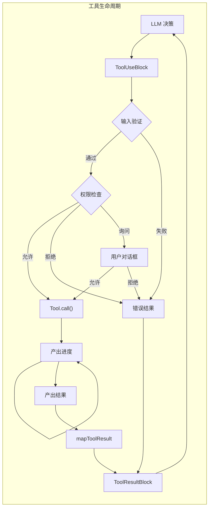

+++
date = '2025-11-14T8:00:00+01:00'
draft = false
title = 'Claude Code 分析 04：工具与执行引擎'
tags = ['Agent']
+++

# 🛠️ 工具与执行引擎



## 工具执行管道：全程异步生成器

Claude Code 工具系统最迷人的方面是在整个执行管道中使用异步生成器。这允许在保持清晰的错误边界的同时流式传输进度更新：

```typescript
// 核心工具执行函数（重构版）
async function* executeTool(
  toolUse: ToolUseBlock,
  toolDef: ToolDefinition,
  context: ToolUseContext,
  permissionFn: PermissionGranter,
  assistantMessage: CliMessage
): AsyncGenerator<CliMessage, void, void> {
  // 阶段 1：使用 Zod 进行输入验证
  const validationStart = performance.now();
  const validation = toolDef.inputSchema.safeParse(toolUse.input);

  if (!validation.success) {
    // 为 LLM 消费格式化 Zod 错误
    const errorMessage = formatZodError(validation.error);
    yield createToolResultMessage({
      tool_use_id: toolUse.id,
      content: [{
        type: 'text',
        text: `Input validation failed:\\n${errorMessage}`
      }],
      is_error: true
    });
    return;
  }

  // 阶段 2：权限检查
  const permissionResult = await checkToolPermission(
    toolDef,
    validation.data,
    context.getToolPermissionContext(),
    permissionFn
  );

  if (permissionResult.behavior === 'deny') {
    yield createToolResultMessage({
      tool_use_id: toolUse.id,
      content: [{
        type: 'text',
        text: `Permission denied: ${permissionResult.message}`
      }],
      is_error: true
    });
    return;
  }

  if (permissionResult.behavior === 'ask') {
    // 为权限对话框产出 UI 事件
    yield {
      type: 'permission_request',
      toolName: toolDef.name,
      input: validation.data,
      suggestions: permissionResult.ruleSuggestions
    };

    // 等待用户决策（由外层循环处理）
    const decision = await permissionFn(
      toolDef,
      validation.data,
      permissionResult
    );

    if (!decision.allowed) {
      yield createToolResultMessage({
        tool_use_id: toolUse.id,
        content: [{
          type: 'text',
          text: 'Tool execution cancelled by user'
        }],
        is_error: true
      });
      return;
    }
  }

  // 阶段 3：带进度跟踪的工具执行
  try {
    const executeStart = performance.now();
    let progressCount = 0;
    let finalResult = null;

    // 调用工具的异步生成器
    for await (const output of toolDef.call(
      validation.data,
      context,
      undefined, // mcpContext - 按要求跳过
      assistantMessage
    )) {
      if (output.type === 'progress') {
        progressCount++;
        yield {
          type: 'progress',
          uuid: `progress-${toolUse.id}-${progressCount}`,
          timestamp: new Date().toISOString(),
          progress: {
            toolUseID: toolUse.id,
            data: output.data
          }
        };
      } else if (output.type === 'result') {
        finalResult = output.data;
      }
    }

    // 阶段 4：结果转换
    if (finalResult !== null) {
      const content = toolDef.mapToolResultToToolResultBlockParam(
        finalResult,
        toolUse.id
      );

      yield createToolResultMessage({
        tool_use_id: toolUse.id,
        content: Array.isArray(content) ? content : [content],
        is_error: false,
        executionTime: performance.now() - executeStart
      });
    }
  } catch (error) {
    // 带丰富上下文的错误处理
    yield createToolResultMessage({
      tool_use_id: toolUse.id,
      content: formatToolError(error, toolDef),
      is_error: true
    });
  }
}

```

**性能特征**：
- 输入验证：O(n)，其中 n 是输入复杂度，通常 <1ms
- 权限检查：O(规则数) + 潜在的用户交互时间
- 工具执行：根据工具差异很大（10ms 到 30s）
- 结果转换：O(输出大小)，通常 <5ms

## Shell 解析器：Claude Code 的秘密武器

最具创新性的组件之一是自定义 shell 解析器，它使得能够通过 shell 命令传递 JavaScript 对象：

```typescript
// Shell 解析器实现（从反编译中重构）
class ShellParser {
  private static OPERATORS = /(\\|\\||&&|;;|\\|&|\\||<|>|>>|&|\\(|\\))/;
  private static SINGLE_QUOTE = /^'([^']*)'$/;
  private static DOUBLE_QUOTE = /^"([^"\\]*(\\.[^"\\]*)*)"$/;

  // 魔法：用于对象嵌入的随机哨兵值
  private static SENTINEL = crypto.randomBytes(16).toString('hex');

  static parse(
    command: string,
    env: Record<string, any>,
    opts?: (token: string) => any
  ): ParsedCommand {
    // 阶段 1：带对象序列化的变量展开
    const expandedCommand = this.expandVariables(command, env);

    // 阶段 2：标记化
    const tokens = this.tokenize(expandedCommand);

    // 阶段 3：如果提供了 opts，则对象再水化
    if (opts && typeof opts === 'function') {
      return tokens.map(token => {
        if (this.isSerializedObject(token)) {
          return this.deserializeObject(token);
        }
        return token;
      });
    }

    return tokens;
  }

  private static expandVariables(
    command: string,
    env: Record<string, any>
  ): string {
    return command.replace(
      /\$\{?(\w+)\}?/g,
      (match, varName) => {
        const value = env[varName];

        // 创新之处：使用哨兵序列化对象
        if (typeof value === 'object' && value !== null) {
          return this.SENTINEL + JSON.stringify(value) + this.SENTINEL;
        }

        return String(value || '');
      }
    );
  }

  private static tokenize(command: string): string[] {
    const tokens: string[] = [];
    let current = '';
    let inSingleQuote = false;
    let inDoubleQuote = false;
    let escape = false;

    for (let i = 0; i < command.length; i++) {
      const char = command[i];
      const next = command[i + 1];

      // 处理引号和转义
      if (!escape) {
        if (char === "'" && !inDoubleQuote) {
          inSingleQuote = !inSingleQuote;
          current += char;
          continue;
        }
        if (char === '"' && !inSingleQuote) {
          inDoubleQuote = !inDoubleQuote;
          current += char;
          continue;
        }
        if (char === '\\') {
          escape = true;
          current += char;
          continue;
        }
      } else {
        escape = false;
        current += char;
        continue;
      }

      // 不在引号中时处理运算符
      if (!inSingleQuote && !inDoubleQuote) {
        const remaining = command.slice(i);
        const operatorMatch = remaining.match(/^(\\|\\||&&|;;|\\|&|\\||<|>|>>|&|\\(|\\))/);

        if (operatorMatch) {
          if (current) {
            tokens.push(current);
            current = '';
          }
          tokens.push(operatorMatch[1]);
          i += operatorMatch[1].length - 1;
          continue;
        }

        // 处理空白
        if (/\s/.test(char)) {
          if (current) {
            tokens.push(current);
            current = '';
          }
          continue;
        }
      }

      current += char;
    }

    if (current) {
      tokens.push(current);
    }

    return tokens;
  }

  private static isSerializedObject(token: string): boolean {
    return token.startsWith(this.SENTINEL) &&
           token.endsWith(this.SENTINEL);
  }

  private static deserializeObject(token: string): any {
    const json = token.slice(
      this.SENTINEL.length,
      -this.SENTINEL.length
    );

    try {
      return JSON.parse(json);
    } catch {
      return token; // 回退到字符串
    }
  }
}

```

此解析器使得如下命令成为可能：

```shell
# 其中 $CONFIG 是一个 JavaScript 对象
mytool --config=$CONFIG --name="test"

# 经过再水化解析后变成：
['mytool', '--config', {setting: true, values: [1,2,3]}, '--name', 'test']

```

## 核心文件操作工具

### ReadTool：多模态文件读取器

```typescript
// ReadTool 实现（重构版）
const ReadToolDefinition: ToolDefinition = {
  name: 'ReadFileTool',
  description: '带行号读取文件内容，支持文本和图像',

  inputSchema: z.object({
    file_path: z.string().describe('文件的绝对路径'),
    offset: z.number().optional().describe('起始行号（从 1 开始）'),
    limit: z.number().optional().default(2000).describe('最大读取行数')
  }),

  async *call(input, context) {
    const { file_path, offset = 1, limit = 2000 } = input;

    // 进度：开始读取
    yield {
      type: 'progress',
      toolUseID: context.currentToolUseId,
      data: { status: `Reading ${path.basename(file_path)}...` }
    };

    // 检查文件是否存在
    const stats = await fs.stat(file_path).catch(() => null);
    if (!stats) {
      throw new Error(`File not found: ${file_path}`);
    }

    // 检测文件类型
    const mimeType = await detectMimeType(file_path);

    if (mimeType.startsWith('image/')) {
      // 处理图像文件
      const imageData = await this.readImage(file_path, context);
      yield { type: 'result', data: imageData };
      return;
    }

    if (file_path.endsWith('.ipynb')) {
      // 处理 Jupyter notebooks
      const notebookData = await this.readNotebook(file_path, offset, limit);
      yield { type: 'result', data: notebookData };
      return;
    }

    // 使用流式处理文本文件
    const content = await this.readTextFile(file_path, offset, limit);

    // 更新文件缓存
    context.readFileState.set(file_path, {
      content: content.fullContent,
      timestamp: stats.mtimeMs
    });

    yield { type: 'result', data: content };
  },

  async readTextFile(filePath: string, offset: number, limit: number) {
    const stream = createReadStream(filePath, { encoding: 'utf8' });
    const lines: string[] = [];
    let lineNumber = 0;
    let truncated = false;

    for await (const chunk of stream) {
      const chunkLines = chunk.split('\\n');

      for (const line of chunkLines) {
        lineNumber++;

        if (lineNumber >= offset && lines.length < limit) {
          // 截断长行
          const truncatedLine = line.length > 2000
            ? line.substring(0, 2000) + '... (truncated)'
            : line;

          // 使用行号格式化（cat -n 风格）
          lines.push(`${lineNumber}\\t${truncatedLine}`);
        }

        if (lines.length >= limit) {
          truncated = true;
          stream.destroy();
          break;
        }
      }
    }

    return {
      formattedContent: lines.join('\\n'),
      fullContent: await fs.readFile(filePath, 'utf8'),
      lineCount: lineNumber,
      truncated
    };
  },

  async readImage(filePath: string, context: ToolUseContext) {
    const buffer = await fs.readFile(filePath);
    const metadata = await sharp(buffer).metadata();

    // 如果太大则调整大小
    let processedBuffer = buffer;
    if (metadata.width > 1024 || metadata.height > 1024) {
      processedBuffer = await sharp(buffer)
        .resize(1024, 1024, {
          fit: 'inside',
          withoutEnlargement: true
        })
        .toBuffer();
    }

    return {
      type: 'image',
      mimeType: `image/${metadata.format}`,
      base64: processedBuffer.toString('base64'),
      dimensions: {
        original: { width: metadata.width, height: metadata.height },
        processed: { width: 1024, height: 1024 }
      }
    };
  },

  mapToolResultToToolResultBlockParam(result, toolUseId) {
    if (result.type === 'image') {
      return [{
        type: 'image',
        source: {
          type: 'base64',
          media_type: result.mimeType,
          data: result.base64
        }
      }];
    }

    // 空文件处理
    if (!result.formattedContent || result.formattedContent.trim() === '') {
      return [{
        type: 'text',
        text: '<system-reminder>Warning: the file exists but the contents are empty.</system-reminder>'
      }];
    }

    // 正常文本结果
    return [{
      type: 'text',
      text: result.formattedContent +
            (result.truncated ? '\\n... (content truncated)' : '')
    }];
  },

  isReadOnly: true
};

```

**性能概况**：

| 文件大小 | 读取时间 | 内存使用 | 瓶颈 |
|---------|---------|---------|------|
| <1MB | <10ms | O(file) | 磁盘 I/O |
| 1-10MB | 10-50ms | O(file) | 内存分配 |
| 10-100MB | 50-500ms | O(limit) | 行处理 |
| >100MB | 500ms+ | O(limit) | 流式分块 |

### EditTool：精确文件修改

```typescript
// EditTool 实现，带验证管道
const EditToolDefinition: ToolDefinition = {
  name: 'EditFileTool',
  description: '在文件中执行精确的字符串替换并进行验证',

  inputSchema: z.object({
    file_path: z.string(),
    old_string: z.string().min(1),
    new_string: z.string(),
    expected_replacements: z.number().optional().default(1)
  }),

  async *call(input, context) {
    const { file_path, old_string, new_string, expected_replacements } = input;

    // 验证 1：文件已被读取
    const cachedFile = context.readFileState.get(file_path);
    if (!cachedFile) {
      throw new Error('File must be read with ReadFileTool before editing');
    }

    // 验证 2：文件未被外部更改
    const currentStats = await fs.stat(file_path);
    if (currentStats.mtimeMs !== cachedFile.timestamp) {
      throw new Error('File has been modified externally since last read');
    }

    // 验证 3：无操作检查
    if (old_string === new_string) {
      throw new Error('old_string and new_string cannot be identical');
    }

    yield {
      type: 'progress',
      toolUseID: context.currentToolUseId,
      data: { status: 'Validating edit...' }
    };

    // 计数出现次数
    const occurrences = this.countOccurrences(
      cachedFile.content,
      old_string
    );

    if (occurrences === 0) {
      throw new Error(`old_string not found in file`);
    }

    if (occurrences !== expected_replacements) {
      throw new Error(
        `Expected ${expected_replacements} replacements but found ${occurrences}`
      );
    }

    // 执行替换
    const newContent = this.performReplacement(
      cachedFile.content,
      old_string,
      new_string,
      expected_replacements
    );

    // 生成差异预览
    const diff = this.generateDiff(
      cachedFile.content,
      newContent,
      file_path
    );

    yield {
      type: 'progress',
      toolUseID: context.currentToolUseId,
      data: {
        status: 'Applying edit...',
        preview: diff
      }
    };

    // 写入文件
    await this.writeFileWithBackup(file_path, newContent);

    // 更新缓存
    context.readFileState.set(file_path, {
      content: newContent,
      timestamp: Date.now()
    });

    // 生成结果片段
    const snippet = this.getContextSnippet(
      newContent,
      new_string,
      5 // 上下文行数
    );

    yield {
      type: 'result',
      data: {
        success: true,
        diff,
        snippet,
        replacements: expected_replacements
      }
    };
  },

  countOccurrences(content: string, searchString: string): number {
    // 转义特殊正则字符
    const escaped = searchString.replace(/[.*+?^${}()|[\]\\]/g, '\\$&');
    const regex = new RegExp(escaped, 'g');
    return (content.match(regex) || []).length;
  },

  performReplacement(
    content: string,
    oldString: string,
    newString: string,
    limit: number
  ): string {
    // 替换期间对某些字符的特殊处理
    const tempOld = oldString.replace(/\$/g, '$$$$');
    const tempNew = newString.replace(/\$/g, '$$$$');

    let result = content;
    let count = 0;
    let lastIndex = 0;

    while (count < limit) {
      const index = result.indexOf(oldString, lastIndex);
      if (index === -1) break;

      result = result.slice(0, index) +
               newString +
               result.slice(index + oldString.length);

      lastIndex = index + newString.length;
      count++;
    }

    return result;
  },

  mapToolResultToToolResultBlockParam(result, toolUseId) {
    return [{
      type: 'text',
      text: `Successfully edited file. ${result.replacements} replacement(s) made.\\n\\n` +
            `Preview of changes:\\n${result.snippet}`
    }];
  },

  isReadOnly: false
};

```

### MultiEditTool：原子性顺序编辑

```typescript
// MultiEditTool - 复杂的顺序编辑编排
const MultiEditToolDefinition: ToolDefinition = {
  name: 'MultiEditFileTool',
  description: '原子性地对文件应用多个编辑',

  inputSchema: z.object({
    file_path: z.string(),
    edits: z.array(z.object({
      old_string: z.string(),
      new_string: z.string(),
      expected_replacements: z.number().optional().default(1)
    })).min(1)
  }),

  async *call(input, context) {
    const { file_path, edits } = input;

    // 加载文件内容
    const cachedFile = context.readFileState.get(file_path);
    if (!cachedFile) {
      throw new Error('File must be read before editing');
    }

    yield {
      type: 'progress',
      toolUseID: context.currentToolUseId,
      data: {
        status: `Planning ${edits.length} edits...`,
        editCount: edits.length
      }
    };

    // 模拟所有编辑以检查冲突
    let workingContent = cachedFile.content;
    const editResults = [];

    for (let i = 0; i < edits.length; i++) {
      const edit = edits[i];

      yield {
        type: 'progress',
        toolUseID: context.currentToolUseId,
        data: {
          status: `Validating edit ${i + 1}/${edits.length}`,
          currentEdit: i + 1
        }
      };

      // 检查此编辑是否有效
      const occurrences = this.countOccurrences(
        workingContent,
        edit.old_string
      );

      if (occurrences === 0) {
        throw new Error(
          `Edit ${i + 1}: old_string not found. ` +
          `This may be due to previous edits modifying the text.`
        );
      }

      if (occurrences !== edit.expected_replacements) {
        throw new Error(
          `Edit ${i + 1}: Expected ${edit.expected_replacements} ` +
          `replacements but found ${occurrences}`
        );
      }

      // 将编辑应用到工作副本
      workingContent = this.performReplacement(
        workingContent,
        edit.old_string,
        edit.new_string,
        edit.expected_replacements
      );

      editResults.push({
        index: i + 1,
        summary: this.summarizeEdit(edit)
      });
    }

    // 所有编辑已验证 - 现在原子性应用
    yield {
      type: 'progress',
      toolUseID: context.currentToolUseId,
      data: { status: 'Applying all edits...' }
    };

    await this.writeFileWithBackup(file_path, workingContent);

    // 更新缓存
    context.readFileState.set(file_path, {
      content: workingContent,
      timestamp: Date.now()
    });

    yield {
      type: 'result',
      data: {
        success: true,
        editsApplied: editResults,
        finalContent: this.getFileSnippet(workingContent)
      }
    };
  },

  // 编辑序列的冲突检测
  detectEditConflicts(edits: EditSequence[]): ConflictReport {
    const conflicts = [];

    for (let i = 0; i < edits.length - 1; i++) {
      for (let j = i + 1; j < edits.length; j++) {
        // 检查编辑 j 的 old_string 是否包含编辑 i 的 new_string
        if (edits[j].old_string.includes(edits[i].new_string)) {
          conflicts.push({
            edit1: i,
            edit2: j,
            type: 'dependency',
            message: `Edit ${j+1} depends on result of edit ${i+1}`
          });
        }

        // 检查重叠区域
        if (this.editsOverlap(edits[i], edits[j])) {
          conflicts.push({
            edit1: i,
            edit2: j,
            type: 'overlap',
            message: `Edits ${i+1} and ${j+1} may affect same region`
          });
        }
      }
    }

    return conflicts;
  },

  isReadOnly: false
};

```

## BashTool：权力与责任

BashTool 可能是最复杂的工具，实现了多个安全层：

```typescript
// BashTool 实现，支持沙盒
const BashToolDefinition: ToolDefinition = {
  name: 'BashTool',
  description: '使用流式输出执行 shell 命令',

  inputSchema: z.object({
    command: z.string(),
    timeout: z.number().optional().default(30000),
    description: z.string().optional(),
    sandbox: z.boolean().optional(),
    shellExecutable: z.string().optional()
  }),

  // 命令的复杂权限检查
  async checkPermissions(input, context, permContext) {
    const { command, sandbox } = input;

    // 提取命令组件
    const parsed = ShellParser.parse(command, process.env);
    const baseCommand = parsed[0];

    // 禁止命令检查
    const FORBIDDEN = ['find', 'grep', 'cat', 'head', 'tail', 'ls'];
    if (FORBIDDEN.includes(baseCommand) && !permContext.mode.includes('bypass')) {
      return {
        behavior: 'deny',
        message: `Use dedicated tools instead of ${baseCommand}`
      };
    }

    // 危险命令需要明确权限
    const DANGEROUS = ['rm', 'dd', 'mkfs', 'fdisk', 'kill'];
    if (DANGEROUS.some(cmd => command.includes(cmd))) {
      return {
        behavior: 'ask',
        message: 'This command could be dangerous',
        ruleSuggestions: [`BashTool(${baseCommand}/*)`]
      };
    }

    // 沙盒模式分析
    if (sandbox === true) {
      // 在沙盒中可用的命令
      const SANDBOX_SAFE = ['echo', 'pwd', 'env', 'date', 'which'];
      if (SANDBOX_SAFE.includes(baseCommand)) {
        return { behavior: 'allow' };
      }
    }

    // 默认权限检查
    return await super.checkPermissions(input, context, permContext);
  },

  async *call(input, context) {
    const { command, timeout, sandbox = false } = input;

    yield {
      type: 'progress',
      toolUseID: context.currentToolUseId,
      data: {
        status: 'Preparing command execution...',
        command: command.substring(0, 100),
        sandbox
      }
    };

    // 准备执行环境
    const execOptions = {
      cwd: context.cwd,
      env: { ...process.env, CLAUDE_CODE: 'true' },
      timeout,
      maxBuffer: 10 * 1024 * 1024, // 10MB
      killSignal: 'SIGTERM'
    };

    if (sandbox && process.platform === 'darwin') {
      // macOS sandbox-exec
      const profile = this.generateSandboxProfile();
      const sandboxedCommand = `sandbox-exec -p '${profile}' ${command}`;
      return yield* this.executeCommand(sandboxedCommand, execOptions, context);
    }

    yield* this.executeCommand(command, execOptions, context);
  },

  async *executeCommand(command, options, context) {
    const startTime = Date.now();
    const child = spawn('bash', ['-c', command], options);

    let stdout = '';
    let stderr = '';
    let outputSize = 0;
    const MAX_OUTPUT = 1024 * 1024; // 1MB 限制

    // 流式传输 stdout
    child.stdout.on('data', (chunk) => {
      const text = chunk.toString();
      stdout += text;
      outputSize += chunk.length;

      if (outputSize < MAX_OUTPUT) {
        // 使用流式输出产出进度
        context.yieldProgress({
          type: 'stdout',
          data: text,
          partial: true
        });
      }
    });

    // 流式传输 stderr
    child.stderr.on('data', (chunk) => {
      const text = chunk.toString();
      stderr += text;
      outputSize += chunk.length;

      if (outputSize < MAX_OUTPUT) {
        context.yieldProgress({
          type: 'stderr',
          data: text,
          partial: true
        });
      }
    });

    // 处理进程完成
    const result = await new Promise((resolve, reject) => {
      child.on('error', reject);

      child.on('exit', (code, signal) => {
        resolve({
          exitCode: code,
          signal,
          stdout: stdout.substring(0, MAX_OUTPUT),
          stderr: stderr.substring(0, MAX_OUTPUT),
          truncated: outputSize > MAX_OUTPUT,
          duration: Date.now() - startTime
        });
      });

      // 处理中止信号
      context.abortController.signal.addEventListener('abort', () => {
        child.kill('SIGTERM');
      });
    });

    yield {
      type: 'result',
      data: result
    };
  },

  generateSandboxProfile(): string {
    // macOS 的限制性沙盒配置
    return `
      (version 1)
      (deny default)
      (allow process-exec (literal "/bin/bash"))
      (allow process-exec (literal "/usr/bin/env"))
      (allow file-read*)
      (deny file-write*)
      (deny network*)
      (allow sysctl-read)
    `;
  },

  // Git 工作流自动化
  async *handleGitCommit(args, context) {
    // 阶段 1：并行信息收集
    const [status, diff, log] = await Promise.all([
      this.runCommand('git status --porcelain'),
      this.runCommand('git diff --cached'),
      this.runCommand('git log -5 --oneline')
    ]);

    yield {
      type: 'progress',
      toolUseID: context.currentToolUseId,
      data: {
        status: 'Analyzing changes...',
        files: status.split('\\n').length - 1
      }
    };

    // 阶段 2：生成提交消息
    const commitAnalysis = await this.analyzeChangesForCommit(
      status,
      diff,
      context
    );

    // 阶段 3：使用 HEREDOC 执行提交
    const commitCommand = `git commit -m "$(cat <<'EOF'
${commitAnalysis.message}

Co-authored-by: Claude <claude@anthropic.com>
EOF
)"`;

    yield* this.executeCommand(commitCommand, {}, context);
  },

  mapToolResultToToolResultBlockParam(result, toolUseId) {
    const output = [];

    if (result.stdout) {
      output.push(`stdout:\\n${result.stdout}`);
    }

    if (result.stderr) {
      output.push(`stderr:\\n${result.stderr}`);
    }

    output.push(`Exit code: ${result.exitCode}`);

    if (result.truncated) {
      output.push('\\n(Output truncated due to size limits)');
    }

    return [{
      type: 'text',
      text: output.join('\\n\\n')
    }];
  },

  isReadOnly: false
};

```

**沙盒模式决策树**：

```plain text
命令分析
├─ 是否为读取操作？(ls, cat, grep)
│  └─ 是 → sandbox=true ✓
├─ 是否需要网络？(curl, wget, git)
│  └─ 是 → sandbox=false ✓
├─ 是否写入文件？(touch, echo >)
│  └─ 是 → sandbox=false ✓
├─ 是否为构建命令？(npm, make, cargo)
│  └─ 是 → sandbox=false ✓
└─ 默认 → sandbox=true (安全默认值)

```

## 搜索与发现工具

### GrepTool：高性能内容搜索

```typescript
// GrepTool 带优化策略
const GrepToolDefinition: ToolDefinition = {
  name: 'GrepTool',
  description: '跨文件快速正则表达式搜索',

  inputSchema: z.object({
    regex: z.string(),
    path: z.string().optional().default('.'),
    include_pattern: z.string().optional()
  }),

  async *call(input, context) {
    const { regex, path, include_pattern } = input;

    // 验证正则表达式
    try {
      new RegExp(regex);
    } catch (e) {
      throw new Error(`Invalid regex: ${e.message}`);
    }

    yield {
      type: 'progress',
      toolUseID: context.currentToolUseId,
      data: { status: 'Searching files...' }
    };

    // 使用 ripgrep 以获得性能
    const rgCommand = this.buildRipgrepCommand(regex, path, include_pattern);
    const matches = await this.executeRipgrep(rgCommand);

    // 按文件分组并限制结果
    const fileGroups = this.groupMatchesByFile(matches);
    const topFiles = this.selectTopFiles(fileGroups, 20); // 前 20 个文件

    yield {
      type: 'result',
      data: {
        matchCount: matches.length,
        fileCount: fileGroups.size,
        files: topFiles
      }
    };
  },

  buildRipgrepCommand(regex: string, path: string, includePattern?: string): string {
    const args = [
      'rg',
      '--files-with-matches',
      '--sort=modified',
      '--max-count=10', // 限制每个文件的匹配数
      '-e', regex,
      path
    ];

    if (includePattern) {
      args.push('--glob', includePattern);
    }

    // 忽略常见非文本文件
    const ignorePatterns = [
      '*.jpg', '*.png', '*.gif',
      '*.mp4', '*.mov',
      '*.zip', '*.tar', '*.gz',
      'node_modules', '.git'
    ];

    ignorePatterns.forEach(pattern => {
      args.push('--glob', `!${pattern}`);
    });

    return args.join(' ');
  },

  isReadOnly: true
};

```

### AgentTool：分层任务分解

```typescript
// AgentTool - 最复杂的工具
const AgentToolDefinition: ToolDefinition = {
  name: 'AgentTool',
  description: '启动子代理执行复杂任务',

  inputSchema: z.object({
    description: z.string().min(3).max(100),
    prompt: z.string().min(10),
    parallelTasksCount: z.number().optional().default(1).max(5),
    model: z.string().optional()
  }),

  async *call(input, context, mcpContext, assistantMessage) {
    const { prompt, parallelTasksCount, model } = input;

    yield {
      type: 'progress',
      toolUseID: context.currentToolUseId,
      data: {
        status: 'Analyzing task complexity...',
        parallel: parallelTasksCount > 1
      }
    };

    // 准备子代理配置
    const subAgentConfig = {
      tools: this.filterToolsForSubAgent(context.options.tools),
      model: model || 'claude-3-haiku-20240307', // 默认快速模型
      maxTokens: this.calculateTokenBudget(prompt),
      systemPrompt: this.buildSubAgentPrompt(prompt)
    };

    // 执行子代理
    const results = await this.executeSubAgents(
      prompt,
      parallelTasksCount,
      subAgentConfig,
      context
    );

    // 报告进度
    for (const result of results) {
      yield {
        type: 'progress',
        toolUseID: context.currentToolUseId,
        data: {
          status: `Sub-agent ${result.index} complete`,
          tokensUsed: result.usage.total_tokens
        }
      };
    }

    // 综合阶段
    if (results.length > 1) {
      yield {
        type: 'progress',
        toolUseID: context.currentToolUseId,
        data: { status: 'Synthesizing results...' }
      };

      const synthesized = await this.synthesizeResults(
        results,
        prompt,
        context
      );

      yield { type: 'result', data: synthesized };
    } else {
      yield { type: 'result', data: results[0].content };
    }
  },

  filterToolsForSubAgent(allTools: ToolDefinition[]): ToolDefinition[] {
    // 防止无限递归
    return allTools.filter(tool =>
      tool.name !== 'AgentTool' &&
      tool.name !== 'UpdateTodoTool' // 子代理不管理待办事项
    );
  },

  async executeSubAgents(
    prompt: string,
    count: number,
    config: SubAgentConfig,
    context: ToolUseContext
  ): Promise<SubAgentResult[]> {
    // 如果并行则拆分任务
    const subtasks = count > 1
      ? this.splitTask(prompt, count)
      : [prompt];

    // 创建链接到父级的中止控制器
    const subControllers = subtasks.map(() =>
      this.createLinkedAbortController(context.abortController)
    );

    // 使用并发限制并行执行
    const executions = subtasks.map((task, index) =>
      this.runSubAgent({
        task,
        index,
        config,
        controller: subControllers[index],
        sharedState: {
          readFileState: context.readFileState, // 共享缓存
          permissionContext: context.getToolPermissionContext()
        }
      })
    );

    // 使用 parallelMap 进行受控并发
    const results = [];
    for await (const result of parallelMap(executions, 5)) {
      results.push(result);
    }

    return results;
  },

  async synthesizeResults(
    results: SubAgentResult[],
    originalPrompt: string,
    context: ToolUseContext
  ): Promise<string> {
    const synthesisPrompt = `
您是一个综合代理。多个子代理已完成调查。
将他们的发现综合成单一、连贯的响应。

原始任务：${originalPrompt}

${results.map((r, i) => `
子代理 ${i + 1} 发现：
${r.content}

使用的 Token：${r.usage.total_tokens}
使用的工具：${r.toolsUsed.join(', ') || 'None'}
`).join('\\n---\\n')}

提供一个结合所有发现的统一响应。
    `.trim();

    // 使用快速模型进行综合
    const synthesizer = new SubAgentExecutor({
      prompt: synthesisPrompt,
      model: 'claude-3-haiku-20240307',
      isSynthesis: true,
      maxTokens: 2000
    });

    return synthesizer.execute();
  },

  calculateTokenBudget(prompt: string): number {
    // 启发式：更长的提示获得更多 token
    const baseTokens = 2000;
    const promptComplexity = prompt.split(' ').length;
    const multiplier = Math.min(promptComplexity / 50, 3);

    return Math.floor(baseTokens * multiplier);
  },

  mapToolResultToToolResultBlockParam(result, toolUseId) {
    return [{
      type: 'text',
      text: result // 已由综合格式化
    }];
  },

  isReadOnly: true // 子代理继承父级权限
};

```

## 工具选择与 LLM 工程

LLM 接收有关工具使用的详细说明：

```typescript
// 工具指令编译器（重构版）
class ToolInstructionCompiler {
  static compileSystemPrompt(tools: ToolDefinition[]): string {
    return `
## 可用工具

您可以使用以下工具：

${tools.map(tool => `
### ${tool.name}
${tool.description}

${tool.prompt || ''}

输入架构：
\`\`\`json
${JSON.stringify(tool.inputJSONSchema || zodToJsonSchema(tool.inputSchema), null, 2)}
\`\`\`

${this.getToolSpecificInstructions(tool)}
`).join('\\n---\\n')}

## 工具使用指南

1. **批处理**：您可以在单个响应中调用多个工具。当请求多条独立信息时，将您的工具调用批处理在一起。

2. **先读后写**：在使用 EditFileTool 或 WriteFileTool 之前，始终使用 ReadFileTool。

3. **优先使用专用工具**：
   - 使用 GrepTool 而不是 BashTool 配合 grep
   - 使用 ReadFileTool 而不是 BashTool 配合 cat
   - 使用 GlobTool 而不是 BashTool 配合 find

4. **安全第一**：
   - 未经用户明确请求，切勿使用 BashTool 执行破坏性命令
   - 尽可能为 BashTool 使用 sandbox=true
   - 验证路径在项目边界内

5. **进度通信**：
   - 工具执行可能需要时间
   - 用户看到进度更新
   - 对长时间运行的工具保持耐心

6. **错误处理**：
   - 工具可能会失败 - 准备备用方案
   - 仔细阅读错误消息
   - 根据错误详情建议修复
    `.trim();
  }

  static getToolSpecificInstructions(tool: ToolDefinition): string {
    const instructions = {
      'BashTool': `
关键：
- 禁止命令：find, grep, cat, head, tail, ls（使用专用工具）
- 始终使用 ripgrep (rg) 而不是 grep
- 对于 git 操作，遵循结构化工作流
- 仅在必要时设置 sandbox=false
      `,

      'EditFileTool': `
关键：
- old_string 不得包含来自 ReadFileTool 的行号前缀
- 保留精确的缩进和空白
- 验证 expected_replacements 与实际出现次数匹配
      `,

      'AgentTool': `
何时使用：
- 跨多个文件的复杂搜索
- 需要多个步骤的任务
- 开放式调查

何时不使用：
- 简单的文件读取（使用 ReadFileTool）
- 特定模式搜索（使用 GrepTool）
      `,

      'UpdateTodoTool': `
始终在以下情况使用此工具：
- 开始复杂任务（3+ 步骤）
- 用户提供多个任务
- 完成任何任务

完成任务后立即标记为完成。
一次只有一个任务处于 in_progress 状态。
      `
    };

    return instructions[tool.name] || '';
  }
}

```

## 性能与安全模式

### 工具性能特征

| 工具 | 延迟 | 内存 | CPU | I/O | 可并行化 |
|-----|-----|------|-----|-----|---------|
| ReadTool | 10-50ms | O(file) | 低 | 高 | ✓ |
| EditTool | 20-100ms | O(file) | 低 | 中 | ✗ |
| MultiEditTool | 50-500ms | O(file) | 中 | 中 | ✗ |
| WriteTool | 10-50ms | O(content) | 低 | 高 | ✗ |
| BashTool | 50ms-30s | 可变 | 可变 | 可变 | ✗* |
| GrepTool | 100-500ms | O(matches) | 高 | 高 | ✓ |
| GlobTool | 50-200ms | O(files) | 低 | 中 | ✓ |
| AgentTool | 2-20s | O(tasks) | 低 | 低 | ✓ |
| WebFetchTool | 500-3000ms | O(page) | 低 | 低 | ✓ |

*BashTool 并行执行仅对只读命令安全

### 内存管理策略

```typescript
// 工具内存优化模式
class ToolMemoryManager {
  // 模式 1：流式处理大文件
  static async *streamLargeFile(path: string, chunkSize = 64 * 1024) {
    const stream = createReadStream(path, {
      highWaterMark: chunkSize
    });

    for await (const chunk of stream) {
      yield chunk;

      // 在分块之间允许 GC
      if (global.gc) global.gc();
    }
  }

  // 模式 2：文件缓存的弱引用
  private static fileCache = new Map<string, WeakRef<FileContent>>();

  static cacheFile(path: string, content: FileContent) {
    const ref = new WeakRef(content);
    this.fileCache.set(path, ref);

    // 注册清理
    this.registry.register(content, path);
  }

  // 模式 3：结果大小限制
  static truncateResult(result: string, maxSize = 100_000): string {
    if (result.length <= maxSize) return result;

    return result.substring(0, maxSize) +
           `\\n... (truncated ${result.length - maxSize} characters)`;
  }
}

```

### 路径安全实现

```typescript
// 所有文件操作的路径验证
class PathSecurityValidator {
  static isPathSafe(
    requestedPath: string,
    context: ToolUseContext
  ): boolean {
    const resolved = path.resolve(requestedPath);

    // 检查主工作目录
    const cwd = context.options.cwd || process.cwd();
    if (resolved.startsWith(cwd)) {
      return true;
    }

    // 检查额外允许的目录
    const additionalDirs = context
      .getToolPermissionContext()
      .additionalWorkingDirectories;

    for (const dir of additionalDirs) {
      if (resolved.startsWith(dir)) {
        return true;
      }
    }

    // 检查拒绝模式
    const DENIED_PATHS = [
      '/etc/passwd',
      '/etc/shadow',
      '~/.ssh/id_rsa',
      '/System', // macOS
      '/Windows/System32' // Windows
    ];

    return !DENIED_PATHS.some(denied =>
      resolved.includes(denied)
    );
  }
}

```
