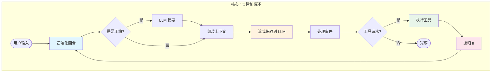
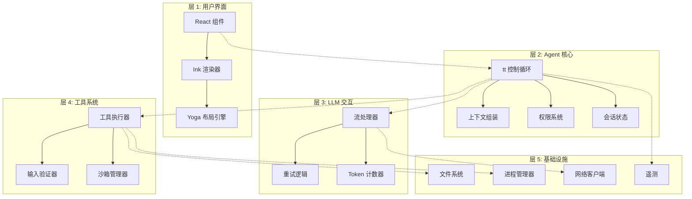

+++
date = '2025-11-14T13:00:00+01:00'
draft = false
title = 'Claude Code 分析 05：架构'
categories = ['Blog']
tags = ['Agent']
+++

# 🏗️ 架构：引擎室



## `tt` 控制循环：跳动的心脏

整个 Claude Code 系统围绕着一个名为 `tt` 的异步生成器函数展开。这个函数协调着每一次交互，从用户输入到 LLM 通信再到工具执行。让我们来剖析这个卓越的工程设计：

```typescript
// 代码库中实际的 tt 函数签名
async function* tt(
  currentMessages: CliMessage[],         // 完整的对话历史
  baseSystemPromptString: string,        // 静态系统指令
  currentGitContext: GitContext,         // 实时 git 状态
  currentClaudeMdContents: ClaudeMdContent[], // 项目上下文
  permissionGranterFn: PermissionGranter, // 权限回调
  toolUseContext: ToolUseContext,         // 共享执行上下文
  activeStreamingToolUse?: ToolUseBlock,  // 恢复流式传输状态
  loopState: {
    turnId: string,        // 此回合的 UUID
    turnCounter: number,   // 递归深度追踪器
    compacted?: boolean,   // 历史压缩标志
    isResuming?: boolean   // 从保存状态恢复
  }
): AsyncGenerator<CliMessage, void, void>

```

这个签名揭示了其复杂的状态管理。该函数产出 `CliMessage` 对象来驱动 UI 更新，同时维护对话流程。让我们检查每个阶段：

### 阶段 1：回合初始化与上下文准备

```typescript
{
  // 向 UI 发出信号表示处理已开始
  yield {
    type: "ui_state_update",
    uuid: `uistate-${loopState.turnId}-${Date.now()}`,
    timestamp: new Date().toISOString(),
    data: { status: "thinking", turnId: loopState.turnId }
  };

  // 检查上下文窗口压力
  let messagesForLlm = currentMessages;
  let wasCompactedThisIteration = false;

  if (await shouldAutoCompact(currentMessages)) {
    yield {
      type: "ui_notification",
      data: { message: "Context is large, attempting to compact..." }
    };

    try {
      const compactionResult = await compactAndStoreConversation(
        currentMessages,
        toolUseContext,
        true
      );
      messagesForLlm = compactionResult.messagesAfterCompacting;
      wasCompactedThisIteration = true;
      loopState.compacted = true;

      yield createSystemNotificationMessage(
        `Conversation history automatically compacted. Summary: ${
          compactionResult.summaryMessage.message.content[0].text
        }`
      );
    } catch (compactionError) {
      yield createSystemErrorMessage(
        `Failed to compact conversation: ${compactionError.message}`
      );
    }
  }
}

```

**阶段 1 的性能概况**：

| 操作       | 典型持续时间 | 复杂度        |
| ---------- | ------------ | ------------- |
| Token 计数 | 10-50ms      | O(n) 消息数   |
| 压缩决策   | <1ms         | O(1)          |
| LLM 摘要   | 2000-3000ms  | 一次 LLM 调用 |
| 消息重建   | 5-10ms       | O(n) 消息数   |

### 阶段 2：动态系统提示组装

系统提示不是静态的——它在每个回合都会重新组装：

```typescript
{
  // 并行获取所有上下文源
  const [toolSpecs, dirStructure] = await Promise.all([
    // 将工具定义转换为 LLM 兼容的规格
    Promise.all(
      toolUseContext.options.tools
        .filter((tool) => (tool.isEnabled ? tool.isEnabled() : true))
        .map(async (tool) =>
          convertToolDefinitionToToolSpecification(tool, toolUseContext),
        ),
    ),
    // 获取当前目录结构
    getDirectoryStructureSnapshot(toolUseContext),
  ]);

  // 组装完整的系统提示
  const systemPromptForLlm = assembleSystemPrompt(
    baseSystemPromptString, // 核心指令
    currentClaudeMdContents, // 项目特定上下文
    currentGitContext, // Git 状态/分支/提交
    dirStructure, // 文件树
    toolSpecs, // 可用工具
  );

  // 准备带缓存控制的消息
  const apiMessages = prepareMessagesForApi(
    messagesForLlm,
    true, // applyEphemeralCacheControl
  );
}
```

组装过程遵循严格的优先级顺序：

```plain text
优先级 1: 基础指令 (~2KB)
    ↓
优先级 2: 模型特定适配 (~500B)
    ↓
优先级 3: CLAUDE.md 内容 (可变，通常 5-50KB)
    ↓
优先级 4: Git 上下文 (~1-5KB)
    ↓
优先级 5: 目录结构 (截断以适配)
    ↓
优先级 6: 工具规格 (~10-20KB)

```

### 阶段 3：LLM 流式传输初始化

```typescript
{
  // 初始化流式调用
  const llmStream = callLlmStreamApi(
    apiMessages,
    systemPromptForLlm,
    toolSpecificationsForLlm,
    toolUseContext.options.mainLoopModel,
    toolUseContext.abortController.signal,
  );

  // 初始化流式响应的累加器
  let accumulatedAssistantMessage: Partial<CliMessage> & {
    message: Partial<ApiMessage> & { content: ContentBlock[] };
  } = {
    type: "assistant",
    uuid: `assistant-${loopState.turnId}-${loopState.turnCounter}-${Date.now()}`,
    timestamp: new Date().toISOString(),
    message: { role: "assistant", content: [] },
  };

  let currentToolUsesFromLlm: ToolUseBlock[] = [];
  let currentThinkingContent: string = "";
  let currentToolInputJsonBuffer: string = "";
}
```

### 阶段 4：流式事件处理状态机

这是魔法发生的地方——实时处理流式事件：

```typescript
{
  for await (const streamEvent of llmStream) {
    // 中止检查
    if (toolUseContext.abortController.signal.aborted) {
      yield createSystemNotificationMessage("LLM stream processing aborted by user.");
      return;
    }

    switch (streamEvent.type) {
      case "message_start":
        accumulatedAssistantMessage.message.id = streamEvent.message.id;
        accumulatedAssistantMessage.message.model = streamEvent.message.model;
        accumulatedAssistantMessage.message.usage = streamEvent.message.usage;
        yield {
          type: "ui_state_update",
          data: {
            status: "assistant_responding",
            model: streamEvent.message.model
          }
        };
        break;

      case "content_block_start":
        const newBlockPlaceholder = { ...streamEvent.content_block };

        // 根据块类型初始化空内容
        if (streamEvent.content_block.type === "thinking") {
          currentThinkingContent = "";
          newBlockPlaceholder.thinking = "";
        } else if (streamEvent.content_block.type === "tool_use") {
          currentToolInputJsonBuffer = "";
          newBlockPlaceholder.input = "";
        } else if (streamEvent.content_block.type === "text") {
          newBlockPlaceholder.text = "";
        }

        accumulatedAssistantMessage.message.content.push(newBlockPlaceholder);
        break;

      case "content_block_delta":
        const lastBlockIndex = accumulatedAssistantMessage.message.content.length - 1;
        if (lastBlockIndex < 0) continue;

        const currentBlock = accumulatedAssistantMessage.message.content[lastBlockIndex];

        if (streamEvent.delta.type === "text_delta" && currentBlock.type === "text") {
          currentBlock.text += streamEvent.delta.text;
          yield {
            type: "ui_text_delta",
            data: {
              textDelta: streamEvent.delta.text,
              blockIndex: lastBlockIndex
            }
          };
        } else if (streamEvent.delta.type === "input_json_delta" && currentBlock.type === "tool_use") {
          currentToolInputJsonBuffer += streamEvent.delta.partial_json;
          currentBlock.input = currentToolInputJsonBuffer;

          // 尝试解析不完整的 JSON 进行预览
          const parseAttempt = tryParsePartialJson(currentToolInputJsonBuffer);
          if (parseAttempt.complete) {
            yield {
              type: "ui_tool_preview",
              data: {
                toolId: currentBlock.id,
                preview: parseAttempt.value
              }
            };
          }
        }
        break;

      case "content_block_stop":
        const completedBlock = accumulatedAssistantMessage.message.content[streamEvent.index];

        if (completedBlock.type === "tool_use") {
          try {
            const parsedInput = JSON.parse(currentToolInputJsonBuffer);
            completedBlock.input = parsedInput;
            currentToolUsesFromLlm.push({
              type: "tool_use",
              id: completedBlock.id,
              name: completedBlock.name,
              input: parsedInput
            });
          } catch (e) {
            // 处理来自 LLM 的格式错误的 JSON
            completedBlock.input = {
              error: "Invalid JSON input from LLM",
              raw_json_string: currentToolInputJsonBuffer,
              parse_error: e.message
            };
          }
          currentToolInputJsonBuffer = "";
        }

        yield {
          type: "ui_content_block_complete",
          data: { block: completedBlock, blockIndex: streamEvent.index }
        };
        break;

      case "message_stop":
        // LLM 生成完成
        const finalAssistantMessage = finalizeCliMessage(
          accumulatedAssistantMessage,
          loopState.turnId,
          loopState.turnCounter
        );
        yield finalAssistantMessage;

        // 移动到阶段 5 或 6...
        break;
    }
  }
}

```

**流式处理性能**：

- 首个 token 延迟：300-800ms（因模型而异）
- Token 吞吐量：50-100 tokens/秒
- UI 更新频率：文本每个 token 更新，工具输入批量更新
- 内存使用：无论响应长度如何保持恒定

### 阶段 5：工具执行编排

当 LLM 请求使用工具时，架构转入执行模式：

```typescript
{
  if (finalAssistantMessage.message.stop_reason === "tool_use" &&
      currentToolUsesFromLlm.length > 0) {

    yield { type: "ui_state_update", data: { status: "executing_tools" } };
    let toolResultMessages: CliMessage[] = [];

    // 使用智能批处理处理工具
    for await (const toolOutcomeMessage of processToolCallsInParallelBatches(
      currentToolUsesFromLlm,
      finalAssistantMessage,
      permissionGranterFn,
      toolUseContext
    )) {
      yield toolOutcomeMessage;

      if (toolOutcomeMessage.type === 'user' && toolOutcomeMessage.isMeta) {
        toolResultMessages.push(toolOutcomeMessage);
      }
    }

    // 检查工具执行期间是否中止
    if (toolUseContext.abortController.signal.aborted) {
      yield createSystemNotificationMessage("Tool execution aborted by user.");
      return;
    }

    // 对结果排序以匹配 LLM 的请求顺序
    const sortedToolResultMessages = sortToolResultsByOriginalRequestOrder(
      toolResultMessages,
      currentToolUsesFromLlm
    );

    // 阶段 6：使用结果递归
    yield* tt(
      [...messagesForLlm, finalAssistantMessage, ...sortedToolResultMessages],
      baseSystemPromptString,
      currentGitContext,
      currentClaudeMdContents,
      permissionGranterFn,
      toolUseContext,
      undefined,
      { ...loopState, turnCounter: loopState.turnCounter + 1 }
    );
    return;
  }
}

```

### 阶段 6：递归控制

`tt` 函数是尾递归的，允许无限的对话深度（受安全措施限制）：

```typescript
// 递归安全措施
if (loopState.turnCounter >= 10) {
  yield createSystemMessage(
    "Maximum conversation depth reached. Please start a new query.",
  );
  return;
}

// 递归前的内存压力检查
const estimatedMemory = estimateConversationMemory(messagesForLlm);
if (estimatedMemory > MEMORY_THRESHOLD) {
  // 继续前强制压缩
  const compacted = await forceCompaction(messagesForLlm);
  messagesForLlm = compacted;
}
```

## 分层架构

Claude Code 实现了一个清晰的分层架构，其中每层都有明确的职责：



### 层间通信模式

层之间的通信遵循严格的模式：

1. **向下通信**：直接函数调用
2. **向上通信**：事件和回调
3. **跨层通信**：共享上下文对象

```typescript
// 示例：UI 到 Agent 核心通信
class UIToAgentBridge {
  async handleUserInput(input: string) {
    // 向下：直接调用
    const action = await pd(input, this.context);

    // 根据操作类型处理
    switch (action.type) {
      case 'normal_prompt':
        // 启动新的 tt 循环迭代
        for await (const message of tt(...)) {
          // 向上：产出事件
          this.uiRenderer.handleMessage(message);
        }
        break;
    }
  }
}

// 示例：工具通过进度向 UI 通信
class ToolToUIBridge {
  async *executeWithProgress(tool: ToolDefinition, input: any) {
    // 工具产出进度
    for await (const event of tool.call(input, this.context)) {
      if (event.type === 'progress') {
        // 转换为 UI 事件
        yield {
          type: 'ui_progress',
          toolName: tool.name,
          progress: event.data
        };
      }
    }
  }
}

```

## 事件驱动与流式架构

整个系统建立在流式原语之上：

### 流式反压管理

```typescript
class StreamBackpressureController {
  private queue: StreamEvent[] = [];
  private processing = false;
  private pressure = {
    high: 1000, // 开始丢弃非关键事件
    critical: 5000, // 除错误外丢弃所有内容
  };

  async handleEvent(event: StreamEvent) {
    this.queue.push(event);

    // 应用反压策略
    if (this.queue.length > this.pressure.critical) {
      // 只保留关键事件
      this.queue = this.queue.filter(
        (e) => e.type === "error" || e.type === "message_stop",
      );
    } else if (this.queue.length > this.pressure.high) {
      // 丢弃文本增量，保留结构
      this.queue = this.queue.filter(
        (e) =>
          e.type !== "content_block_delta" || e.delta.type !== "text_delta",
      );
    }

    if (!this.processing) {
      await this.processQueue();
    }
  }

  private async processQueue() {
    this.processing = true;

    while (this.queue.length > 0) {
      const batch = this.queue.splice(0, 100); // 批量处理
      await this.processBatch(batch);

      // 让出给事件循环
      await new Promise((resolve) => setImmediate(resolve));
    }

    this.processing = false;
  }
}
```

### 进度事件聚合

多个并发操作需要协调的进度报告：

```typescript
class ProgressAggregator {
  private progressStreams = new Map<string, AsyncIterator<ProgressEvent>>();

  async *aggregateProgress(
    operations: Array<{ id: string; operation: AsyncIterator<any> }>,
  ): AsyncGenerator<AggregatedProgress> {
    // 启动所有操作
    for (const { id, operation } of operations) {
      this.progressStreams.set(id, operation);
    }

    // 轮询所有流
    while (this.progressStreams.size > 0) {
      const promises = Array.from(this.progressStreams.entries()).map(
        async ([id, stream]) => {
          const { value, done } = await stream.next();
          return { id, value, done };
        },
      );

      // 竞争下一个事件
      const result = await Promise.race(promises);

      if (result.done) {
        this.progressStreams.delete(result.id);
      } else if (result.value.type === "progress") {
        yield {
          type: "aggregated_progress",
          source: result.id,
          progress: result.value,
        };
      }
    }
  }
}
```

## 状态管理架构

Claude Code 使用实用的状态管理方法：

### 全局会话状态

```typescript
// 带直接变更的单例会话状态
class SessionState {
  private static instance: SessionState;

  // 核心状态
  sessionId: string = crypto.randomUUID();
  cwd: string = process.cwd();
  totalCostUSD: number = 0;
  totalAPIDuration: number = 0;

  // 模型使用追踪
  modelTokens: Record<
    string,
    {
      inputTokens: number;
      outputTokens: number;
      cacheReadInputTokens: number;
      cacheCreationInputTokens: number;
    }
  > = {};

  // 直接变更方法
  incrementCost(amount: number) {
    this.totalCostUSD += amount;
    this.persistToDisk(); // 异步，非阻塞
  }

  updateTokenUsage(model: string, usage: TokenUsage) {
    if (!this.modelTokens[model]) {
      this.modelTokens[model] = {
        inputTokens: 0,
        outputTokens: 0,
        cacheReadInputTokens: 0,
        cacheCreationInputTokens: 0,
      };
    }

    const tokens = this.modelTokens[model];
    tokens.inputTokens += usage.input_tokens || 0;
    tokens.outputTokens += usage.output_tokens || 0;
    tokens.cacheReadInputTokens += usage.cache_read_input_tokens || 0;
    tokens.cacheCreationInputTokens += usage.cache_creation_input_tokens || 0;
  }

  private async persistToDisk() {
    // 防抖写入以避免过多 I/O
    clearTimeout(this.persistTimer);
    this.persistTimer = setTimeout(async () => {
      await fs.writeFile(".claude/session.json", JSON.stringify(this, null, 2));
    }, 1000);
  }
}
```

### 使用弱引用的文件状态

```typescript
class ReadFileState {
  private cache = new Map<string, WeakRef<FileContent>>();
  private registry = new FinalizationRegistry((path: string) => {
    // 当 FileContent 被垃圾回收时清理
    this.cache.delete(path);
  });

  set(path: string, content: FileContent) {
    const ref = new WeakRef(content);
    this.cache.set(path, ref);
    this.registry.register(content, path);
  }

  get(path: string): FileContent | undefined {
    const ref = this.cache.get(path);
    if (ref) {
      const content = ref.deref();
      if (!content) {
        // 内容已被垃圾回收
        this.cache.delete(path);
        return undefined;
      }
      return content;
    }
  }

  checkFreshness(path: string): "fresh" | "stale" | "unknown" {
    const cached = this.get(path);
    if (!cached) return "unknown";

    const stats = fs.statSync(path);
    if (stats.mtimeMs !== cached.timestamp) {
      return "stale";
    }

    return "fresh";
  }
}
```

## 安全架构

安全性通过多个独立层实现：

### 第 1 层：权限系统

```typescript
class PermissionEvaluator {
  private ruleCache = new Map<string, CompiledRule>();

  async evaluate(
    tool: ToolDefinition,
    input: any,
    context: ToolPermissionContext,
  ): Promise<PermissionDecision> {
    // 优先级顺序评估
    const scopes: PermissionRuleScope[] = [
      "cliArg", // 最高：命令行
      "localSettings", // 项目特定覆盖
      "projectSettings", // 共享项目规则
      "policySettings", // 组织策略
      "userSettings", // 最低：用户偏好
    ];

    for (const scope of scopes) {
      const decision = await this.evaluateScope(tool, input, context, scope);

      if (decision.behavior !== "continue") {
        return decision;
      }
    }

    // 无匹配规则 - 询问用户
    return {
      behavior: "ask",
      suggestions: this.generateSuggestions(tool, input),
    };
  }

  private compileRule(rule: string): CompiledRule {
    if (this.ruleCache.has(rule)) {
      return this.ruleCache.get(rule)!;
    }

    // 解析规则语法：ToolName(glob/pattern)
    const match = rule.match(/^(\w+)(?:\((.+)\))?$/);
    if (!match) throw new Error(`Invalid rule: ${rule}`);

    const [, toolPattern, pathPattern] = match;

    const compiled = {
      toolMatcher: new RegExp(`^${toolPattern.replace("*", ".*")}$`),
      pathMatcher: pathPattern ? picomatch(pathPattern) : null,
    };

    this.ruleCache.set(rule, compiled);
    return compiled;
  }
}
```

### 第 2 层：沙箱架构

```typescript
// macOS 沙箱实现
class MacOSSandboxManager {
  generateProfile(command: string, restrictions: SandboxRestrictions): string {
    const profile = `
(version 1)
(deny default)

; Base permissions
(allow process-exec (literal "/bin/bash"))
(allow process-exec (literal "/usr/bin/env"))

; File system access
${restrictions.allowRead ? "(allow file-read*)" : "(deny file-read*)"}
${restrictions.allowWrite ? "(allow file-write*)" : "(deny file-write*)"}

; Network access
${
  restrictions.allowNetwork
    ? `
(allow network-outbound)
(allow network-inbound)
`
    : `
(deny network*)
`
}

; System operations
(allow sysctl-read)
(allow mach-lookup)

; Temporary files
(allow file-write* (subpath "/tmp"))
(allow file-write* (subpath "/var/tmp"))
    `.trim();

    return profile;
  }

  async executeSandboxed(
    command: string,
    profile: string,
  ): Promise<ExecutionResult> {
    // 将配置文件写入临时文件
    const profilePath = await this.writeTemporaryProfile(profile);

    try {
      // 使用 sandbox-exec 执行
      const result = await exec(`sandbox-exec -p '${profilePath}' ${command}`);

      return result;
    } finally {
      // 清理
      await fs.unlink(profilePath);
    }
  }
}
```

### 第 3 层：路径验证

```typescript
class PathValidator {
  private boundaries: Set<string>;
  private deniedPatterns: RegExp[];

  constructor(context: SecurityContext) {
    this.boundaries = new Set([
      context.projectRoot,
      ...context.additionalWorkingDirectories,
    ]);

    this.deniedPatterns = [
      /\/\.(ssh|gnupg)\//, // SSH/GPG 密钥
      /\/(etc|sys|proc)\//, // 系统目录
      /\.pem$|\.key$/, // 私钥
      /\.(env|envrc)$/, // 环境文件
    ];
  }

  validate(requestedPath: string): ValidationResult {
    const absolute = path.resolve(requestedPath);

    // 检查边界
    const inBoundary = Array.from(this.boundaries).some((boundary) =>
      absolute.startsWith(boundary),
    );

    if (!inBoundary) {
      return {
        allowed: false,
        reason: "Path outside allowed directories",
      };
    }

    // 检查拒绝模式
    for (const pattern of this.deniedPatterns) {
      if (pattern.test(absolute)) {
        return {
          allowed: false,
          reason: `Path matches denied pattern: ${pattern}`,
        };
      }
    }

    return { allowed: true };
  }
}
```

## 性能架构

### ANR（应用程序无响应）检测

ANR 系统使用工作线程来监控主事件循环：

```typescript
// 工作线程脚本（嵌入为 base64）
const anrWorkerScript = `
const { parentPort } = require('worker_threads');

let config = { anrThreshold: 5000, captureStackTrace: false };
let lastPing = Date.now();
let anrTimer = null;

function checkANR() {
  const elapsed = Date.now() - lastPing;

  if (elapsed > config.anrThreshold) {
    // 主线程无响应
    parentPort.postMessage({
      type: 'anr',
      payload: {
        elapsed,
        stackTrace: config.captureStackTrace
          ? captureMainThreadStack()
          : null
      }
    });
  }

  // 安排下次检查
  anrTimer = setTimeout(checkANR, 100);
}

async function captureMainThreadStack() {
  // 如果可用，使用检查器协议
  try {
    const { Session } = require('inspector');
    const session = new Session();
    session.connect();

    const { result } = await session.post('Debugger.enable');
    const stack = await session.post('Debugger.getStackTrace');

    session.disconnect();
    return stack;
  } catch (e) {
    return null;
  }
}

parentPort.on('message', (msg) => {
  if (msg.type === 'config') {
    config = msg.payload;
    lastPing = Date.now();
    checkANR(); // 开始监控
  } else if (msg.type === 'ping') {
    lastPing = Date.now();
  }
});
`;

// 主线程 ANR 集成
class ANRMonitor {
  private worker: Worker;
  private pingInterval: NodeJS.Timer;

  constructor(options: ANROptions = {}) {
    // 从嵌入脚本创建工作线程
    this.worker = new Worker(anrWorkerScript, { eval: true });

    // 配置工作线程
    this.worker.postMessage({
      type: "config",
      payload: {
        anrThreshold: options.threshold || 5000,
        captureStackTrace: options.captureStackTrace !== false,
      },
    });

    // 启动心跳
    this.pingInterval = setInterval(() => {
      this.worker.postMessage({ type: "ping" });
    }, options.pollInterval || 50);

    // 处理 ANR 检测
    this.worker.on("message", (msg) => {
      if (msg.type === "anr") {
        this.handleANR(msg.payload);
      }
    });
  }

  private handleANR(data: ANRData) {
    // 记录到遥测
    Sentry.captureException(
      new Error(`Application not responding for ${data.elapsed}ms`),
      {
        extra: {
          stackTrace: data.stackTrace,
          eventLoopDelay: this.getEventLoopDelay(),
        },
      },
    );
  }
}
```

### 战略缓存层

```typescript
class CacheArchitecture {
  // L1: 内存缓存
  private schemaCache = new LRUCache<string, JSONSchema>(100);
  private patternCache = new LRUCache<string, CompiledPattern>(500);
  private gitContextCache = new TTLCache<string, GitContext>(30_000); // 30s TTL

  // L2: 弱引用缓存
  private fileContentCache = new WeakRefCache<FileContent>();

  // L3: 磁盘缓存
  private diskCache = new DiskCache(".claude/cache");

  async get<T>(
    key: string,
    generator: () => Promise<T>,
    options: CacheOptions = {},
  ): Promise<T> {
    // 检查 L1
    if (this.schemaCache.has(key)) {
      return this.schemaCache.get(key) as T;
    }

    // 检查 L2
    const weakRef = this.fileContentCache.get(key);
    if (weakRef) {
      return weakRef as T;
    }

    // 检查 L3
    if (options.persistent) {
      const diskValue = await this.diskCache.get(key);
      if (diskValue) {
        return diskValue;
      }
    }

    // 生成并缓存
    const value = await generator();

    // 存储在适当的缓存中
    if (options.weak) {
      this.fileContentCache.set(key, value);
    } else if (options.persistent) {
      await this.diskCache.set(key, value, options.ttl);
    } else {
      this.schemaCache.set(key, value as any);
    }

    return value;
  }
}
```

## 遥测与可观测性设计

三支柱方法提供全面的可见性：

### 支柱 1：错误追踪（Sentry）

```typescript
class ErrorBoundary {
  static wrap<T extends (...args: any[]) => any>(
    fn: T,
    context: ErrorContext
  ): T {
    return (async (...args: Parameters<T>) => {
      const span = Sentry.startTransaction({
        name: context.operation,
        op: context.category
      });

      try {
        const result = await fn(...args);
        span.setStatus('ok');
        return result;
      } catch (error) {
        span.setStatus('internal_error');

        Sentry.captureException(error, {
          contexts: {
            operation: context,
            state: this.captureState()
          },
          fingerprint: this.generateFingerprint(error, context)
        });

        throw error;
      } finally {
        span.finish();
      }
    }) as T;
  }

  private static captureState() {
    return {
      sessionId: SessionState.instance.sessionId,
      conversationDepth: /* current depth */,
      activeTools: /* currently executing */,
      memoryUsage: process.memoryUsage(),
      eventLoopDelay: this.getEventLoopDelay()
    };
  }
}

```

### 支柱 2：指标（OpenTelemetry）

```typescript
class MetricsCollector {
  private meters = {
    api: meter.createCounter('api_calls_total'),
    tokens: meter.createHistogram('token_usage'),
    tools: meter.createHistogram('tool_execution_duration'),
    streaming: meter.createHistogram('streaming_latency')
  };

  recordApiCall(result: ApiCallResult) {
    this.meters.api.add(1, {
      model: result.model,
      status: result.status,
      provider: result.provider
    });

    this.meters.tokens.record(result.totalTokens, {
      model: result.model,
      type: 'total'
    });
  }

  recordToolExecution(tool: string, duration: number, success: boolean) {
    this.meters.tools.record(duration, {
      tool,
      success: String(success),
      concurrent: /* was parallel? */
    });
  }
}

```

### 支柱 3：功能标志（Statsig）

```typescript
class FeatureManager {
  async checkGate(gate: string, context?: FeatureContext): Promise<boolean> {
    return statsig.checkGate(gate, {
      userID: SessionState.instance.sessionId,
      custom: {
        model: context?.model,
        toolsEnabled: context?.tools,
        platform: process.platform,
      },
    });
  }

  async getConfig<T>(config: string, defaultValue: T): Promise<T> {
    const dynamicConfig = statsig.getConfig(config);
    return dynamicConfig.get("value", defaultValue);
  }
}
```

## 资源管理

### 进程生命周期管理

```typescript
class ProcessManager {
  private processes = new Map<string, ChildProcess>();
  private limits = {
    maxProcesses: 10,
    maxMemoryPerProcess: 512 * 1024 * 1024, // 512MB
    maxTotalMemory: 2 * 1024 * 1024 * 1024, // 2GB
  };

  async spawn(
    id: string,
    command: string,
    options: SpawnOptions,
  ): Promise<ManagedProcess> {
    // 检查限制
    if (this.processes.size >= this.limits.maxProcesses) {
      await this.killOldestProcess();
    }

    const child = spawn("bash", ["-c", command], {
      ...options,
      // 资源限制
      env: {
        ...options.env,
        NODE_OPTIONS: `--max-old-space-size=${this.limits.maxMemoryPerProcess / 1024 / 1024}`,
      },
    });

    // 监控资源
    const monitor = setInterval(() => {
      this.checkProcessHealth(id, child);
    }, 1000);

    this.processes.set(id, child);

    return new ManagedProcess(child, monitor);
  }

  private async checkProcessHealth(id: string, proc: ChildProcess) {
    try {
      const usage = await pidusage(proc.pid);

      if (usage.memory > this.limits.maxMemoryPerProcess) {
        console.warn(`Process ${id} exceeding memory limit`);
        proc.kill("SIGTERM");
      }
    } catch (e) {
      // 进程可能已退出
      this.processes.delete(id);
    }
  }
}
```

### 网络连接池

```typescript
class NetworkPool {
  private pools = new Map<string, ConnectionPool>();

  getPool(provider: string): ConnectionPool {
    if (!this.pools.has(provider)) {
      this.pools.set(
        provider,
        new ConnectionPool({
          maxConnections: provider === "anthropic" ? 10 : 5,
          maxIdleTime: 30_000,
          keepAlive: true,
        }),
      );
    }

    return this.pools.get(provider)!;
  }

  async request(provider: string, options: RequestOptions): Promise<Response> {
    const pool = this.getPool(provider);
    const connection = await pool.acquire();

    try {
      return await connection.request(options);
    } finally {
      pool.release(connection);
    }
  }
}
```

---

_此架构分析基于逆向工程和反编译。实际实现可能有所不同。所呈现的模式代表基于可观察行为和高性能 Node.js 应用程序常见实践推断的架构决策。_
