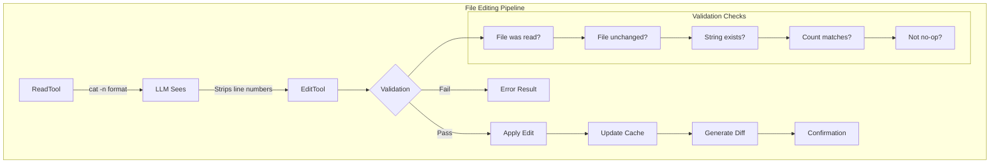

+++
date = '2025-11-14T15:00:00+01:00'
draft = false
title = 'Claude Code 分析 07：文件编辑'
categories = ['Blog']
tags = ['Agent']
+++

# ✏️ 文件编辑：AI 辅助代码修改



## 文件编辑流水线架构

Claude Code 中的文件编辑不仅仅是修改文本——它是一个精心设计的流水线系统，用于处理 AI 辅助代码修改的复杂性：

```typescript
class FileEditingPipeline {
  // 四阶段编辑循环
  static async executeEdit(
    tool: EditTool,
    input: EditInput,
    context: ToolContext
  ): Promise<EditResult> {
    // 阶段 1：验证
    const validation = await this.validateEdit(input, context);
    if (!validation.valid) {
      return { success: false, error: validation.error };
    }

    // 阶段 2：准备
    const prepared = await this.prepareEdit(input, validation.fileState);

    // 阶段 3：应用
    const result = await this.applyEdit(prepared);

    // 阶段 4：验证
    const verified = await this.verifyEdit(result, input);

    return verified;
  }

  // 状态追踪系统
  private static fileStates = new Map<string, FileState>();

  interface FileState {
    content: string;
    hash: string;
    mtime: number;
    encoding: BufferEncoding;
    lineEndings: '\\n' | '\\r\\n' | '\\r';
    isBinary: boolean;
    size: number;
  }
}

```

**为什么使用多个工具而不是一个通用编辑器？**

| 工具               | 用途           | 保证         | 失败模式                  |
| ------------------ | -------------- | ------------ | ------------------------- |
| `EditTool`         | 单个字符串替换 | 精确匹配计数 | 如果出现次数 ≠ 预期则失败 |
| `MultiEditTool`    | 顺序编辑       | 原子批处理   | 如果任何编辑无效则失败    |
| `WriteTool`        | 完全替换       | 完全覆写     | 如果未先读取则失败        |
| `NotebookEditTool` | 单元格操作     | 保留结构     | 如果单元格缺失则失败      |

每个工具都提供了通用编辑器在保持对 LLM 友好性的同时无法维护的特定保证。

## 行号问题：一个看似简单实则复杂的挑战

文件编辑中最关键的挑战是行号前缀问题：

```typescript
// LLM 从 ReadTool 看到的内容：
const readOutput = `
1\tfunction hello() {
2\t  console.log('Hello, world!');
3\t}
`;

// LLM 可能错误尝试编辑的内容：
const wrongOldString = "2\t  console.log('Hello, world!');"; // 错误 - 包含行号

// 应该使用的内容：
const correctOldString = "  console.log('Hello, world!');"; // 正确 - 无行号
```

行号剥离逻辑：

```typescript
class LineNumberHandler {
  // LLM 收到关于此的详细说明
  static readonly LINE_NUMBER_PATTERN = /^\d+\t/;

  static stripLineNumbers(content: string): string {
    return content
      .split("\\n")
      .map((line) => line.replace(this.LINE_NUMBER_PATTERN, ""))
      .join("\\n");
  }

  // 但真正的挑战是确保 LLM 执行此操作
  static validateOldString(
    oldString: string,
    fileContent: string,
  ): ValidationResult {
    // 检查 1：oldString 是否包含行号前缀？
    if (this.LINE_NUMBER_PATTERN.test(oldString)) {
      return {
        valid: false,
        error:
          "old_string appears to contain line number prefix. " +
          "Remove the number and tab at the start.",
        suggestion: oldString.replace(this.LINE_NUMBER_PATTERN, ""),
      };
    }

    // 检查 2：字符串是否存在于文件中？
    const occurrences = this.countOccurrences(fileContent, oldString);
    if (occurrences === 0) {
      // 尝试检测是否为行号问题
      const possibleLineNumber = oldString.match(/^(\d+)\t/);
      if (possibleLineNumber) {
        const lineNum = parseInt(possibleLineNumber[1]);
        const actualLine = this.getLine(fileContent, lineNum);
        return {
          valid: false,
          error: `String not found. Did you include line number ${lineNum}?`,
          suggestion: actualLine,
        };
      }
    }

    return { valid: true, occurrences };
  }
}
```

## EditTool：字符串替换的外科手术精度

EditTool 实现了零歧义的精确字符串匹配：

```typescript
class EditToolImplementation {
  static async executeEdit(
    input: EditInput,
    context: ToolContext,
  ): Promise<EditResult> {
    const {
      file_path,
      old_string,
      new_string,
      expected_replacements = 1,
    } = input;

    // 步骤 1：检索缓存的文件状态
    const cachedFile = context.readFileState.get(file_path);
    if (!cachedFile) {
      throw new Error(
        "File must be read with ReadFileTool before editing. " +
          "This ensures you have the current file content.",
      );
    }

    // 步骤 2：验证文件未被外部更改
    const currentStats = await fs.stat(file_path);
    if (currentStats.mtimeMs !== cachedFile.timestamp) {
      throw new Error(
        "File has been modified externally since last read. " +
          "Please read the file again to see current content.",
      );
    }

    // 步骤 3：验证编辑
    const validation = this.validateEdit(
      old_string,
      new_string,
      cachedFile.content,
      expected_replacements,
    );

    if (!validation.valid) {
      throw new Error(validation.error);
    }

    // 步骤 4：应用替换
    const newContent = this.performReplacement(
      cachedFile.content,
      old_string,
      new_string,
      expected_replacements,
    );

    // 步骤 5：生成 diff 用于验证
    const diff = this.generateDiff(cachedFile.content, newContent, file_path);

    // 步骤 6：使用相同的编码/行尾写入
    await this.writeFilePreservingFormat(file_path, newContent, cachedFile);

    // 步骤 7：更新缓存
    context.readFileState.set(file_path, {
      content: newContent,
      timestamp: Date.now(),
    });

    // 步骤 8：生成上下文片段
    const snippet = this.generateContextSnippet(
      newContent,
      new_string,
      5, // 上下文行数
    );

    return {
      success: true,
      diff,
      snippet,
      replacements: expected_replacements,
    };
  }

  private static validateEdit(
    oldString: string,
    newString: string,
    fileContent: string,
    expectedReplacements: number,
  ): EditValidation {
    // 无操作检查
    if (oldString === newString) {
      return {
        valid: false,
        error:
          "old_string and new_string are identical. No changes would be made.",
      };
    }

    // 空 old_string 特殊情况（插入）
    if (oldString === "") {
      return {
        valid: false,
        error: "Empty old_string not allowed. Use WriteTool for new files.",
      };
    }

    // 使用精确字符串匹配计数出现次数
    const occurrences = this.countExactOccurrences(fileContent, oldString);

    if (occurrences === 0) {
      return {
        valid: false,
        error:
          "old_string not found in file. Ensure exact match including whitespace.",
        suggestion: this.findSimilarStrings(fileContent, oldString),
      };
    }

    if (occurrences !== expectedReplacements) {
      return {
        valid: false,
        error:
          `Expected ${expectedReplacements} replacement(s) but found ${occurrences} occurrence(s). ` +
          `Set expected_replacements to ${occurrences} or refine old_string.`,
      };
    }

    return { valid: true };
  }

  private static countExactOccurrences(
    content: string,
    searchString: string,
  ): number {
    // 转义特殊正则字符以进行精确匹配
    const escaped = searchString.replace(/[.*+?^${}()|[\]\\]/g, "\\$&");
    const regex = new RegExp(escaped, "g");
    return (content.match(regex) || []).length;
  }

  private static performReplacement(
    content: string,
    oldString: string,
    newString: string,
    limit: number,
  ): string {
    // 为特殊替换模式转义字符
    const escapeReplacement = (str: string) => {
      return str
        .replace(/\$/g, "$$$$") // $ -> $$
        .replace(/\n/g, "\\n") // 保留换行符
        .replace(/\r/g, "\\r"); // 保留回车符
    };

    const escapedNew = escapeReplacement(newString);

    let result = content;
    let count = 0;
    let lastIndex = 0;

    // 手动替换以遵守限制
    while (count < limit) {
      const index = result.indexOf(oldString, lastIndex);
      if (index === -1) break;

      result =
        result.slice(0, index) +
        newString + // 使用原始字符串，非转义版本
        result.slice(index + oldString.length);

      lastIndex = index + newString.length;
      count++;
    }

    return result;
  }

  private static generateDiff(
    oldContent: string,
    newContent: string,
    filePath: string,
  ): string {
    // 使用统一 diff 格式
    const diff = createUnifiedDiff(
      filePath,
      filePath,
      oldContent,
      newContent,
      "before edit",
      "after edit",
      { context: 3 },
    );

    return diff;
  }
}
```

**为什么 `expected_replacements` 很重要**：

```typescript
// 场景：多次出现
const fileContent = `
function processUser(user) {
  console.log(user);
  return user;
}
`;

// 没有 expected_replacements：
edit({
  old_string: "user",
  new_string: "userData",
});
// 结果：所有出现都被替换（函数参数也被替换了！）

// 有 expected_replacements：
edit({
  old_string: "user",
  new_string: "userData",
  expected_replacements: 2, // 仅使用，不包括参数
});
// 结果：失败 - 强制使用更具体的 old_string
```

## MultiEditTool：原子顺序操作

MultiEditTool 解决了多个相关编辑的复杂问题：

```typescript
class MultiEditToolImplementation {
  static async executeMultiEdit(
    input: MultiEditInput,
    context: ToolContext,
  ): Promise<MultiEditResult> {
    const { file_path, edits } = input;

    // 一次加载文件
    const cachedFile = context.readFileState.get(file_path);
    if (!cachedFile) {
      throw new Error("File must be read before editing");
    }

    // 在应用任何编辑之前验证所有编辑
    const validationResult = this.validateAllEdits(edits, cachedFile.content);

    if (!validationResult.valid) {
      throw new Error(validationResult.error);
    }

    // 顺序应用编辑到工作副本
    let workingContent = cachedFile.content;
    const appliedEdits: AppliedEdit[] = [];

    for (let i = 0; i < edits.length; i++) {
      const edit = edits[i];

      try {
        // 针对当前工作内容验证此编辑
        const validation = this.validateSingleEdit(edit, workingContent, i);

        if (!validation.valid) {
          throw new Error(`Edit ${i + 1} failed: ${validation.error}`);
        }

        // 应用编辑
        const beforeEdit = workingContent;
        workingContent = this.applyEdit(workingContent, edit);

        appliedEdits.push({
          index: i,
          edit,
          diff: this.generateEditDiff(beforeEdit, workingContent),
          summary: this.summarizeEdit(edit),
        });
      } catch (error) {
        // 原子失败 - 不写入任何更改
        throw new Error(
          `MultiEdit aborted at edit ${i + 1}/${edits.length}: ${error.message}`,
        );
      }
    }

    // 所有编辑已验证并应用 - 一次写入
    await this.writeFilePreservingFormat(file_path, workingContent, cachedFile);

    // 更新缓存
    context.readFileState.set(file_path, {
      content: workingContent,
      timestamp: Date.now(),
    });

    return {
      success: true,
      editsApplied: appliedEdits,
      totalDiff: this.generateDiff(
        cachedFile.content,
        workingContent,
        file_path,
      ),
    };
  }

  private static validateAllEdits(
    edits: Edit[],
    originalContent: string,
  ): ValidationResult {
    // 检查空编辑数组
    if (edits.length === 0) {
      return {
        valid: false,
        error: "No edits provided",
      };
    }

    // 检测潜在冲突
    const conflicts = this.detectEditConflicts(edits, originalContent);
    if (conflicts.length > 0) {
      return {
        valid: false,
        error:
          "Edit conflicts detected:\\n" +
          conflicts.map((c) => c.description).join("\\n"),
      };
    }

    // 模拟所有编辑以确保它们有效
    let simulatedContent = originalContent;
    for (let i = 0; i < edits.length; i++) {
      const edit = edits[i];
      const occurrences = this.countOccurrences(
        simulatedContent,
        edit.old_string,
      );

      if (occurrences === 0) {
        return {
          valid: false,
          error:
            `Edit ${i + 1}: old_string not found. ` +
            `Previous edits may have removed it.`,
        };
      }

      if (occurrences !== (edit.expected_replacements || 1)) {
        return {
          valid: false,
          error:
            `Edit ${i + 1}: Expected ${edit.expected_replacements || 1} ` +
            `replacements but found ${occurrences}`,
        };
      }

      // 应用到模拟
      simulatedContent = this.applyEdit(simulatedContent, edit);
    }

    return { valid: true };
  }

  private static detectEditConflicts(
    edits: Edit[],
    content: string,
  ): EditConflict[] {
    const conflicts: EditConflict[] = [];

    for (let i = 0; i < edits.length - 1; i++) {
      for (let j = i + 1; j < edits.length; j++) {
        const edit1 = edits[i];
        const edit2 = edits[j];

        // 冲突类型 1：后续编辑修改前一个编辑的结果
        if (edit2.old_string.includes(edit1.new_string)) {
          conflicts.push({
            type: "dependency",
            edits: [i, j],
            description: `Edit ${j + 1} depends on result of edit ${i + 1}`,
          });
        }

        // 冲突类型 2：重叠替换
        if (this.editsOverlap(edit1, edit2, content)) {
          conflicts.push({
            type: "overlap",
            edits: [i, j],
            description: `Edits ${i + 1} and ${j + 1} affect overlapping text`,
          });
        }

        // 冲突类型 3：相同目标，不同替换
        if (
          edit1.old_string === edit2.old_string &&
          edit1.new_string !== edit2.new_string
        ) {
          conflicts.push({
            type: "contradiction",
            edits: [i, j],
            description: `Edits ${i + 1} and ${j + 1} replace same text differently`,
          });
        }
      }
    }

    return conflicts;
  }

  private static editsOverlap(
    edit1: Edit,
    edit2: Edit,
    content: string,
  ): boolean {
    // 查找所有出现的位置
    const positions1 = this.findAllPositions(content, edit1.old_string);
    const positions2 = this.findAllPositions(content, edit2.old_string);

    // 检查是否有任何位置重叠
    for (const pos1 of positions1) {
      const end1 = pos1 + edit1.old_string.length;

      for (const pos2 of positions2) {
        const end2 = pos2 + edit2.old_string.length;

        // 检查重叠
        if (pos1 < end2 && pos2 < end1) {
          return true;
        }
      }
    }

    return false;
  }
}
```

**冲突检测实战**：

```typescript
// 示例：依赖编辑
const edits = [
  {
    old_string: "console.log",
    new_string: "logger.info",
  },
  {
    old_string: "logger.info('test')", // 依赖于第一个编辑！
    new_string: "logger.debug('test')",
  },
];
// 结果：检测到冲突 - 编辑 2 依赖于编辑 1

// 示例：安全的顺序编辑
const safeEdits = [
  {
    old_string: "var x",
    new_string: "let x",
  },
  {
    old_string: "var y",
    new_string: "let y",
  },
];
// 结果：无冲突 - 独立更改
```

## WriteTool：完整文件操作

WriteTool 处理完整的文件创建或替换：

```typescript
class WriteToolImplementation {
  static async executeWrite(
    input: WriteInput,
    context: ToolContext,
  ): Promise<WriteResult> {
    const { file_path, content } = input;

    // 检查文件是否存在
    const exists = await fs
      .access(file_path)
      .then(() => true)
      .catch(() => false);

    if (exists) {
      // 现有文件 - 必须已读取
      const cachedFile = context.readFileState.get(file_path);
      if (!cachedFile) {
        throw new Error(
          "Existing file must be read with ReadFileTool before overwriting. " +
            "This prevents accidental data loss.",
        );
      }

      // 验证未被外部修改
      const stats = await fs.stat(file_path);
      if (stats.mtimeMs !== cachedFile.timestamp) {
        throw new Error(
          "File has been modified externally. " +
            "Read the file again to see current content before overwriting.",
        );
      }
    }

    // 文档文件限制
    if (this.isDocumentationFile(file_path) && !context.explicitlyAllowed) {
      throw new Error(
        "Creating documentation files (*.md, README) requires explicit user request. " +
          "Focus on code implementation unless specifically asked for docs.",
      );
    }

    // 准备写入操作
    const writeData = await this.prepareWriteData(
      content,
      exists ? context.readFileState.get(file_path) : null,
    );

    // 确保目录存在
    const dir = path.dirname(file_path);
    await fs.mkdir(dir, { recursive: true });

    // 写入文件
    await fs.writeFile(file_path, writeData.content, {
      encoding: writeData.encoding,
      mode: writeData.mode,
    });

    // 更新缓存
    context.readFileState.set(file_path, {
      content: content,
      timestamp: Date.now(),
    });

    // 生成结果
    if (exists) {
      const snippet = this.generateContextSnippet(content, null, 10);
      return {
        success: true,
        action: "updated",
        snippet,
      };
    } else {
      return {
        success: true,
        action: "created",
        path: file_path,
      };
    }
  }

  private static async prepareWriteData(
    content: string,
    existingFile: FileState | null,
  ): Promise<WriteData> {
    // 检测或保留行尾
    let lineEnding = "\\n"; // 默认为 LF

    if (existingFile) {
      // 保留现有行尾
      lineEnding = existingFile.lineEndings;
    } else if (process.platform === "win32") {
      // Windows 上新文件默认为 CRLF
      lineEnding = "\\r\\n";
    }

    // 规范化然后应用正确的行尾
    const normalizedContent = content.replace(/\r\n|\r|\n/g, "\\n");
    const finalContent = normalizedContent.replace(/\n/g, lineEnding);

    // 检测编码（简化 - 实际实现更复杂）
    const encoding = existingFile?.encoding || "utf8";

    // 更新时保留文件模式
    const mode = existingFile ? (await fs.stat(existingFile.path)).mode : 0o644;

    return {
      content: finalContent,
      encoding,
      mode,
    };
  }
}
```

## 验证层：深度防御

每个编辑操作都经过多个验证层：

```typescript
class FileValidationPipeline {
  static async validateFileOperation(
    operation: FileOperation,
    context: ToolContext,
  ): Promise<ValidationResult> {
    // 层 1：路径验证
    const pathValidation = await this.validatePath(operation.path, context);
    if (!pathValidation.valid) return pathValidation;

    // 层 2：权限检查
    const permissionCheck = await this.checkPermissions(operation, context);
    if (!permissionCheck.valid) return permissionCheck;

    // 层 3：文件状态验证
    const stateValidation = await this.validateFileState(operation, context);
    if (!stateValidation.valid) return stateValidation;

    // 层 4：内容验证
    const contentValidation = await this.validateContent(operation);
    if (!contentValidation.valid) return contentValidation;

    // 层 5：安全检查
    const safetyCheck = await this.performSafetyChecks(operation, context);
    if (!safetyCheck.valid) return safetyCheck;

    return { valid: true };
  }

  private static async validatePath(
    filePath: string,
    context: ToolContext,
  ): Promise<ValidationResult> {
    // 绝对路径要求
    if (!path.isAbsolute(filePath)) {
      return {
        valid: false,
        error: "File path must be absolute",
        suggestion: path.resolve(filePath),
      };
    }

    // 路径遍历防护
    const resolved = path.resolve(filePath);
    const normalized = path.normalize(filePath);

    if (resolved !== normalized) {
      return {
        valid: false,
        error: "Path contains suspicious traversal patterns",
      };
    }

    // 边界检查
    const projectRoot = context.projectRoot;
    const allowed = [projectRoot, ...context.additionalWorkingDirectories];

    const isAllowed = allowed.some((dir) =>
      resolved.startsWith(path.resolve(dir)),
    );

    if (!isAllowed) {
      return {
        valid: false,
        error: "Path is outside allowed directories",
        allowedDirs: allowed,
      };
    }

    // 特殊文件防护
    const forbidden = [
      /\.git\//,
      /node_modules\//,
      /\.env$/,
      /\.ssh\//,
      /\.gnupg\//,
    ];

    if (forbidden.some((pattern) => pattern.test(resolved))) {
      return {
        valid: false,
        error: "Operation on sensitive files not allowed",
      };
    }

    return { valid: true };
  }

  private static async validateFileState(
    operation: FileOperation,
    context: ToolContext,
  ): Promise<ValidationResult> {
    if (operation.type === "create") {
      // 检查文件是否已存在
      const exists = await fs
        .access(operation.path)
        .then(() => true)
        .catch(() => false);

      if (exists && !operation.overwrite) {
        return {
          valid: false,
          error:
            "File already exists. Use WriteTool with prior read to overwrite.",
        };
      }
    }

    if (operation.type === "edit" || operation.type === "overwrite") {
      const cached = context.readFileState.get(operation.path);

      if (!cached) {
        return {
          valid: false,
          error: "File must be read before editing",
        };
      }

      // 陈旧性检查
      try {
        const stats = await fs.stat(operation.path);
        if (stats.mtimeMs !== cached.timestamp) {
          const timeDiff = stats.mtimeMs - cached.timestamp;
          return {
            valid: false,
            error: "File has been modified externally",
            details: {
              cachedTime: new Date(cached.timestamp),
              currentTime: new Date(stats.mtimeMs),
              difference: `${Math.abs(timeDiff)}ms`,
            },
          };
        }
      } catch (error) {
        return {
          valid: false,
          error: "File no longer exists or is inaccessible",
        };
      }
    }

    return { valid: true };
  }
}
```

## Diff 生成 & 反馈：闭环

每次编辑都会为 LLM 生成丰富的反馈：

```typescript
class DiffGenerator {
  static generateEditFeedback(
    operation: EditOperation,
    result: EditResult,
  ): EditFeedback {
    const feedback: EditFeedback = {
      summary: this.generateSummary(operation, result),
      diff: this.generateDiff(operation, result),
      snippet: this.generateContextSnippet(operation, result),
      statistics: this.generateStatistics(operation, result),
    };

    return feedback;
  }

  private static generateDiff(
    operation: EditOperation,
    result: EditResult,
  ): string {
    const { oldContent, newContent, filePath } = result;

    // 根据更改大小使用不同的 diff 策略
    const changeRatio = this.calculateChangeRatio(oldContent, newContent);

    if (changeRatio < 0.1) {
      // 小更改 - 使用统一 diff
      return this.generateUnifiedDiff(oldContent, newContent, filePath, {
        context: 5,
      });
    } else if (changeRatio < 0.5) {
      // 中等更改 - 使用单词 diff
      return this.generateWordDiff(oldContent, newContent, filePath);
    } else {
      // 大更改 - 使用摘要 diff
      return this.generateSummaryDiff(oldContent, newContent, filePath);
    }
  }

  private static generateContextSnippet(
    operation: EditOperation,
    result: EditResult,
  ): string {
    const { newContent, changedRanges } = result;
    const lines = newContent.split("\\n");
    const snippets: string[] = [];

    for (const range of changedRanges) {
      const start = Math.max(0, range.start - 5);
      const end = Math.min(lines.length, range.end + 5);

      const snippet = lines
        .slice(start, end)
        .map((line, idx) => {
          const lineNum = start + idx + 1;
          const isChanged = lineNum >= range.start && lineNum <= range.end;
          const prefix = isChanged ? ">" : " ";
          return `${prefix} ${lineNum}\\t${line}`;
        })
        .join("\\n");

      snippets.push(snippet);
    }

    // 限制总片段大小
    const combined = snippets.join("\\n...\\n");
    if (combined.length > 1000) {
      return combined.substring(0, 1000) + "\\n... (truncated)";
    }

    return combined;
  }

  private static generateUnifiedDiff(
    oldContent: string,
    newContent: string,
    filePath: string,
    options: DiffOptions,
  ): string {
    const oldLines = oldContent.split("\\n");
    const newLines = newContent.split("\\n");

    // 使用 Myers diff 算法
    const diff = new MyersDiff(oldLines, newLines);
    const hunks = diff.getHunks(options.context);

    // 格式化为统一 diff
    const header = [
      `--- ${filePath}\\t(before edit)`,
      `+++ ${filePath}\\t(after edit)`,
      "",
    ].join("\\n");

    const formattedHunks = hunks
      .map((hunk) => {
        const range =
          `@@ -${hunk.oldStart},${hunk.oldLength} ` +
          `+${hunk.newStart},${hunk.newLength} @@`;

        const lines = hunk.lines.map((line) => {
          switch (line.type) {
            case "unchanged":
              return ` ${line.content}`;
            case "deleted":
              return `-${line.content}`;
            case "added":
              return `+${line.content}`;
          }
        });

        return [range, ...lines].join("\\n");
      })
      .join("\\n");

    return header + formattedHunks;
  }
}
```

## 特殊情况 & 边界条件

文件编辑必须处理众多边界情况：

```typescript
class EdgeCaseHandlers {
  // 空文件处理
  static handleEmptyFile(
    operation: EditOperation,
    content: string,
  ): HandlerResult {
    if (content.trim() === "") {
      if (operation.type === "edit") {
        return {
          error: "Cannot edit empty file. Use WriteTool to add content.",
        };
      }

      // ReadTool 的特殊反馈
      return {
        warning:
          "<system-reminder>Warning: the file exists but the contents are empty.</system-reminder>",
      };
    }

    return { ok: true };
  }

  // 二进制文件检测
  static async detectBinaryFile(
    filePath: string,
    content: Buffer,
  ): Promise<boolean> {
    // 检查空字节（二进制文件中常见）
    for (let i = 0; i < Math.min(content.length, 8192); i++) {
      if (content[i] === 0) {
        return true;
      }
    }

    // 检查文件扩展名
    const binaryExtensions = [
      ".jpg",
      ".png",
      ".gif",
      ".pdf",
      ".zip",
      ".exe",
      ".dll",
      ".so",
      ".dylib",
    ];

    const ext = path.extname(filePath).toLowerCase();
    if (binaryExtensions.includes(ext)) {
      return true;
    }

    // 使用文件魔数
    const magicNumbers = {
      png: [0x89, 0x50, 0x4e, 0x47],
      jpg: [0xff, 0xd8, 0xff],
      pdf: [0x25, 0x50, 0x44, 0x46],
      zip: [0x50, 0x4b, 0x03, 0x04],
    };

    for (const [type, magic] of Object.entries(magicNumbers)) {
      if (this.bufferStartsWith(content, magic)) {
        return true;
      }
    }

    return false;
  }

  // 符号链接处理
  static async handleSymlink(
    filePath: string,
    operation: FileOperation,
  ): Promise<SymlinkResult> {
    try {
      const stats = await fs.lstat(filePath);

      if (!stats.isSymbolicLink()) {
        return { isSymlink: false };
      }

      const target = await fs.readlink(filePath);
      const resolvedTarget = path.resolve(path.dirname(filePath), target);

      // 检查目标是否存在
      const targetExists = await fs
        .access(resolvedTarget)
        .then(() => true)
        .catch(() => false);

      if (!targetExists && operation.type === "read") {
        return {
          isSymlink: true,
          error: `Broken symlink: points to non-existent ${target}`,
        };
      }

      // 对于编辑操作，提供选择
      if (operation.type === "edit") {
        return {
          isSymlink: true,
          warning: `This is a symlink to ${target}. Edit will modify the target file.`,
          target: resolvedTarget,
        };
      }

      return {
        isSymlink: true,
        target: resolvedTarget,
      };
    } catch (error) {
      return { isSymlink: false };
    }
  }

  // 编码检测和处理
  static async detectEncoding(
    filePath: string,
    buffer: Buffer,
  ): Promise<EncodingInfo> {
    // 检查 BOM
    if (buffer[0] === 0xef && buffer[1] === 0xbb && buffer[2] === 0xbf) {
      return { encoding: "utf8", hasBOM: true };
    }

    if (buffer[0] === 0xff && buffer[1] === 0xfe) {
      return { encoding: "utf16le", hasBOM: true };
    }

    if (buffer[0] === 0xfe && buffer[1] === 0xff) {
      return { encoding: "utf16be", hasBOM: true };
    }

    // 尝试 UTF-8
    try {
      const decoded = buffer.toString("utf8");
      // 检查替换字符
      if (!decoded.includes("\\ufffd")) {
        return { encoding: "utf8", hasBOM: false };
      }
    } catch {}

    // 回退启发式
    const nullBytes = buffer.filter((b) => b === 0).length;
    const highBytes = buffer.filter((b) => b > 127).length;

    if (nullBytes > buffer.length * 0.1) {
      return { encoding: "binary", hasBOM: false };
    }

    if (highBytes < buffer.length * 0.1) {
      return { encoding: "ascii", hasBOM: false };
    }

    // 默认为 utf8 并警告
    return {
      encoding: "utf8",
      hasBOM: false,
      warning: "Encoding uncertain, assuming UTF-8",
    };
  }
}
```

## 性能优化

大规模文件编辑需要仔细优化：

```typescript
class FileEditingPerformance {
  // 大文件的缓存策略
  private static chunkCache = new Map<string, ChunkedFile>();

  static async readLargeFile(
    filePath: string,
    options: ReadOptions,
  ): Promise<FileContent> {
    const stats = await fs.stat(filePath);

    // 对超过 10MB 的文件使用流式处理
    if (stats.size > 10 * 1024 * 1024) {
      return this.streamRead(filePath, options);
    }

    // 对 1-10MB 的文件使用分块缓存
    if (stats.size > 1024 * 1024) {
      return this.chunkedRead(filePath, options);
    }

    // 小文件直接读取
    return this.directRead(filePath, options);
  }

  private static async chunkedRead(
    filePath: string,
    options: ReadOptions,
  ): Promise<FileContent> {
    const cached = this.chunkCache.get(filePath);

    if (cached && cached.mtime === (await fs.stat(filePath)).mtimeMs) {
      // 使用缓存的分块
      return this.assembleFromChunks(cached, options);
    }

    // 分块读取
    const chunkSize = 256 * 1024; // 256KB 分块
    const chunks: Buffer[] = [];
    const stream = createReadStream(filePath, {
      highWaterMark: chunkSize,
    });

    for await (const chunk of stream) {
      chunks.push(chunk);
    }

    // 缓存以供将来使用
    this.chunkCache.set(filePath, {
      chunks,
      mtime: (await fs.stat(filePath)).mtimeMs,
      encoding: "utf8",
    });

    return this.assembleFromChunks({ chunks }, options);
  }

  // 批量编辑准备
  static prepareBatchEdits(edits: Edit[], content: string): PreparedBatch {
    // 预先计算所有位置
    const positions = new Map<string, number[]>();

    for (const edit of edits) {
      if (!positions.has(edit.old_string)) {
        positions.set(
          edit.old_string,
          this.findAllPositions(content, edit.old_string),
        );
      }
    }

    // 按位置排序编辑（反向顺序以安全应用）
    const sortedEdits = edits
      .map((edit) => ({
        edit,
        position: positions.get(edit.old_string)![0],
      }))
      .sort((a, b) => b.position - a.position);

    return {
      edits: sortedEdits,
      positions,
      canApplyInReverse: true,
    };
  }

  // 内存高效的 diff 生成
  static *generateStreamingDiff(
    oldContent: string,
    newContent: string,
  ): Generator<DiffChunk> {
    const oldLines = oldContent.split("\\n");
    const newLines = newContent.split("\\n");

    // 对大文件使用滑动窗口
    const windowSize = 1000;
    let oldIndex = 0;
    let newIndex = 0;

    while (oldIndex < oldLines.length || newIndex < newLines.length) {
      const oldWindow = oldLines.slice(oldIndex, oldIndex + windowSize);
      const newWindow = newLines.slice(newIndex, newIndex + windowSize);

      const diff = this.computeWindowDiff(
        oldWindow,
        newWindow,
        oldIndex,
        newIndex,
      );

      yield diff;

      oldIndex += diff.oldConsumed;
      newIndex += diff.newConsumed;
    }
  }
}
```

**性能特性**：

| 文件大小  | 操作         | 方法 | 时间     | 内存     |
| --------- | ------------ | ---- | -------- | -------- |
| <100KB    | 读取         | 直接 | <5ms     | O(n)     |
| 100KB-1MB | 读取         | 直接 | 5-20ms   | O(n)     |
| 1-10MB    | 读取         | 分块 | 20-100ms | O(chunk) |
| >10MB     | 读取         | 流式 | 100ms+   | O(1)     |
| 任意      | 编辑（单个） | 内存 | <10ms    | O(n)     |
| 任意      | 编辑（多个） | 顺序 | <50ms    | O(n)     |
| 任意      | 写入         | 直接 | <20ms    | O(n)     |

## 常见失败模式 & 恢复

理解常见失败有助于构建健壮的编辑：

```typescript
class FailureRecovery {
  // 外部修改冲突
  static async handleExternalModification(
    filePath: string,
    cachedState: FileState,
    operation: EditOperation,
  ): Promise<RecoveryStrategy> {
    const currentContent = await fs.readFile(filePath, "utf8");
    const currentStats = await fs.stat(filePath);

    // 尝试三方合并
    const mergeResult = await this.attemptThreeWayMerge(
      cachedState.content, // 基础
      operation.newContent, // 我们的
      currentContent, // 他们的
    );

    if (mergeResult.success && !mergeResult.conflicts) {
      return {
        strategy: "auto_merge",
        content: mergeResult.merged,
        warning: "File was modified externally. Changes have been merged.",
      };
    }

    // 生成冲突标记
    if (mergeResult.conflicts) {
      return {
        strategy: "conflict_markers",
        content: mergeResult.conflictMarked,
        error: "Merge conflicts detected. Manual resolution required.",
        conflicts: mergeResult.conflicts,
      };
    }

    // 回退：显示 diff 并询问
    return {
      strategy: "user_decision",
      error: "File modified externally",
      options: ["Overwrite external changes", "Abort edit", "Read file again"],
      diff: this.generateDiff(cachedState.content, currentContent),
    };
  }

  // 编码问题
  static async handleEncodingError(
    filePath: string,
    error: Error,
    content: string,
  ): Promise<RecoveryStrategy> {
    // 尝试不同的编码
    const encodings = ["utf8", "latin1", "utf16le"];

    for (const encoding of encodings) {
      try {
        const buffer = Buffer.from(content, encoding as any);
        await fs.writeFile(filePath + ".test", buffer);
        await fs.unlink(filePath + ".test");

        return {
          strategy: "alternate_encoding",
          encoding,
          warning: `Using ${encoding} encoding instead of UTF-8`,
        };
      } catch {}
    }

    // 二进制回退
    return {
      strategy: "binary_write",
      warning: "Treating as binary file",
      content: Buffer.from(content, "binary"),
    };
  }

  // 磁盘空间问题
  static async handleDiskSpaceError(
    filePath: string,
    requiredBytes: number,
  ): Promise<RecoveryStrategy> {
    const diskInfo = await this.getDiskInfo(path.dirname(filePath));

    if (diskInfo.available < requiredBytes) {
      // 计算可以释放的空间
      const suggestions = await this.analyzeDiskUsage(path.dirname(filePath));

      return {
        strategy: "free_space",
        error:
          `Insufficient disk space. Need ${this.formatBytes(requiredBytes)}, ` +
          `have ${this.formatBytes(diskInfo.available)}`,
        suggestions: suggestions.map((s) => ({
          path: s.path,
          size: this.formatBytes(s.size),
          type: s.type,
        })),
      };
    }

    // 可能是配额问题
    return {
      strategy: "quota_check",
      error: "Write failed despite apparent free space. Check disk quotas.",
      command: `quota -v ${process.env.USER}`,
    };
  }

  // 部分写入恢复
  static async recoverPartialWrite(
    filePath: string,
    expectedSize: number,
  ): Promise<RecoveryResult> {
    try {
      const stats = await fs.stat(filePath);

      if (stats.size === 0) {
        // 完全失败 - 检查备份
        const backupPath = filePath + ".backup";
        if (
          await fs
            .access(backupPath)
            .then(() => true)
            .catch(() => false)
        ) {
          await fs.rename(backupPath, filePath);
          return {
            recovered: true,
            method: "backup_restore",
          };
        }
      }

      if (stats.size < expectedSize) {
        // 部分写入 - 检查临时文件
        const tempPath = filePath + ".tmp";
        if (
          await fs
            .access(tempPath)
            .then(() => true)
            .catch(() => false)
        ) {
          const tempStats = await fs.stat(tempPath);
          if (tempStats.size === expectedSize) {
            await fs.rename(tempPath, filePath);
            return {
              recovered: true,
              method: "temp_file_restore",
            };
          }
        }
      }

      return {
        recovered: false,
        partialSize: stats.size,
        expectedSize,
      };
    } catch (error) {
      return {
        recovered: false,
        error: error.message,
      };
    }
  }
}
```

---
